SEC1-SA2 Group 2-Espiritu
================
Espiritu, Joseph Raphael
2026-05-10

# **A. Machine Learning Models for Customer Churn**

*Title: Predicting Customer Churn with Regression-Based and Tree-Based
Methods*

## *1. Introduction*

Customer churn, also known as customer attrition or turnover, is the
percentage of customers who stop doing business, cancel subscriptions,
or discontinue using a company’s services over a specific period.
Predicting customer behavior through data-driven approaches allows
companies to identify customers who are likely to cancel their
subscriptions and implement retention strategies before churn occurs.
This study utilizes the Orange Telecom Churn Dataset, which contains
customer usage information and churn labels indicating whether a
customer canceled their subscription. The dataset was divided into an
80% training and cross-validation set (churn-bigml-80) and a 20% testing
and evaluation set (churn-bigml-20). The primary objective of this study
is to build and evaluate regression-based and tree-based machine
learning models capable of predicting customer churn and comparing their
predictive performance.

## *2. Methodology*

### 2.1 Data Description

``` r
# Load training and testing datasets
churn_train <- read.csv("churn-bigml-80.csv")
churn_test  <- read.csv("churn-bigml-20.csv")

# Dimensions
dim(churn_train)
```

    ## [1] 2666   20

``` r
dim(churn_test)
```

    ## [1] 667  20

``` r
# Display Variable Types
str(churn_train)
```

    ## 'data.frame':    2666 obs. of  20 variables:
    ##  $ State                 : chr  "KS" "OH" "NJ" "OH" ...
    ##  $ Account.length        : int  128 107 137 84 75 118 121 147 141 74 ...
    ##  $ Area.code             : int  415 415 415 408 415 510 510 415 415 415 ...
    ##  $ International.plan    : chr  "No" "No" "No" "Yes" ...
    ##  $ Voice.mail.plan       : chr  "Yes" "Yes" "No" "No" ...
    ##  $ Number.vmail.messages : int  25 26 0 0 0 0 24 0 37 0 ...
    ##  $ Total.day.minutes     : num  265 162 243 299 167 ...
    ##  $ Total.day.calls       : int  110 123 114 71 113 98 88 79 84 127 ...
    ##  $ Total.day.charge      : num  45.1 27.5 41.4 50.9 28.3 ...
    ##  $ Total.eve.minutes     : num  197.4 195.5 121.2 61.9 148.3 ...
    ##  $ Total.eve.calls       : int  99 103 110 88 122 101 108 94 111 148 ...
    ##  $ Total.eve.charge      : num  16.78 16.62 10.3 5.26 12.61 ...
    ##  $ Total.night.minutes   : num  245 254 163 197 187 ...
    ##  $ Total.night.calls     : int  91 103 104 89 121 118 118 96 97 94 ...
    ##  $ Total.night.charge    : num  11.01 11.45 7.32 8.86 8.41 ...
    ##  $ Total.intl.minutes    : num  10 13.7 12.2 6.6 10.1 6.3 7.5 7.1 11.2 9.1 ...
    ##  $ Total.intl.calls      : int  3 3 5 7 3 6 7 6 5 5 ...
    ##  $ Total.intl.charge     : num  2.7 3.7 3.29 1.78 2.73 1.7 2.03 1.92 3.02 2.46 ...
    ##  $ Customer.service.calls: int  1 1 0 2 3 0 3 0 0 0 ...
    ##  $ Churn                 : chr  "False" "False" "False" "False" ...

``` r
str(churn_test)
```

    ## 'data.frame':    667 obs. of  20 variables:
    ##  $ State                 : chr  "LA" "IN" "NY" "SC" ...
    ##  $ Account.length        : int  117 65 161 111 49 36 65 119 10 68 ...
    ##  $ Area.code             : int  408 415 415 415 510 408 415 415 408 415 ...
    ##  $ International.plan    : chr  "No" "No" "No" "No" ...
    ##  $ Voice.mail.plan       : chr  "No" "No" "No" "No" ...
    ##  $ Number.vmail.messages : int  0 0 0 0 0 30 0 0 0 0 ...
    ##  $ Total.day.minutes     : num  184 129 333 110 119 ...
    ##  $ Total.day.calls       : int  97 137 67 103 117 128 120 114 112 70 ...
    ##  $ Total.day.charge      : num  31.4 21.9 56.6 18.8 20.3 ...
    ##  $ Total.eve.minutes     : num  352 228 318 137 215 ...
    ##  $ Total.eve.calls       : int  80 83 97 102 109 80 122 117 66 164 ...
    ##  $ Total.eve.charge      : num  29.9 19.4 27 11.7 18.3 ...
    ##  $ Total.night.minutes   : num  216 209 161 190 179 ...
    ##  $ Total.night.calls     : int  90 111 128 105 90 109 118 91 57 103 ...
    ##  $ Total.night.charge    : num  9.71 9.4 7.23 8.53 8.04 ...
    ##  $ Total.intl.minutes    : num  8.7 12.7 5.4 7.7 11.1 14.5 13.2 8.8 11.4 12.1 ...
    ##  $ Total.intl.calls      : int  4 6 9 6 1 6 5 3 6 3 ...
    ##  $ Total.intl.charge     : num  2.35 3.43 1.46 2.08 3 3.92 3.56 2.38 3.08 3.27 ...
    ##  $ Customer.service.calls: int  1 4 4 2 1 0 3 5 2 3 ...
    ##  $ Churn                 : chr  "False" "True" "True" "False" ...

The training dataset (churn_train) contains 2,666 observations and 20
variables, while the testing dataset (churn_test) contains 667
observations and 20 variables, reflecting the intended 80/20 dataset
split for machine learning model development and evaluation. The dataset
consists of both numerical and categorical variables related to customer
account information, call usage behavior, service plans, and customer
service interactions, with the Churn variable serving as the target
classification outcome.

``` r
# Summary Statistics
summary(churn_train)
```

    ##     State           Account.length    Area.code     International.plan
    ##  Length:2666        Min.   :  1.0   Min.   :408.0   Length:2666       
    ##  Class :character   1st Qu.: 73.0   1st Qu.:408.0   Class :character  
    ##  Mode  :character   Median :100.0   Median :415.0   Mode  :character  
    ##                     Mean   :100.6   Mean   :437.4                     
    ##                     3rd Qu.:127.0   3rd Qu.:510.0                     
    ##                     Max.   :243.0   Max.   :510.0                     
    ##  Voice.mail.plan    Number.vmail.messages Total.day.minutes Total.day.calls
    ##  Length:2666        Min.   : 0.000        Min.   :  0.0     Min.   :  0.0  
    ##  Class :character   1st Qu.: 0.000        1st Qu.:143.4     1st Qu.: 87.0  
    ##  Mode  :character   Median : 0.000        Median :179.9     Median :101.0  
    ##                     Mean   : 8.022        Mean   :179.5     Mean   :100.3  
    ##                     3rd Qu.:19.000        3rd Qu.:215.9     3rd Qu.:114.0  
    ##                     Max.   :50.000        Max.   :350.8     Max.   :160.0  
    ##  Total.day.charge Total.eve.minutes Total.eve.calls Total.eve.charge
    ##  Min.   : 0.00    Min.   :  0.0     Min.   :  0     Min.   : 0.00   
    ##  1st Qu.:24.38    1st Qu.:165.3     1st Qu.: 87     1st Qu.:14.05   
    ##  Median :30.59    Median :200.9     Median :100     Median :17.08   
    ##  Mean   :30.51    Mean   :200.4     Mean   :100     Mean   :17.03   
    ##  3rd Qu.:36.70    3rd Qu.:235.1     3rd Qu.:114     3rd Qu.:19.98   
    ##  Max.   :59.64    Max.   :363.7     Max.   :170     Max.   :30.91   
    ##  Total.night.minutes Total.night.calls Total.night.charge Total.intl.minutes
    ##  Min.   : 43.7       Min.   : 33.0     Min.   : 1.970     Min.   : 0.00     
    ##  1st Qu.:166.9       1st Qu.: 87.0     1st Qu.: 7.513     1st Qu.: 8.50     
    ##  Median :201.2       Median :100.0     Median : 9.050     Median :10.20     
    ##  Mean   :201.2       Mean   :100.1     Mean   : 9.053     Mean   :10.24     
    ##  3rd Qu.:236.5       3rd Qu.:113.0     3rd Qu.:10.640     3rd Qu.:12.10     
    ##  Max.   :395.0       Max.   :166.0     Max.   :17.770     Max.   :20.00     
    ##  Total.intl.calls Total.intl.charge Customer.service.calls    Churn          
    ##  Min.   : 0.000   Min.   :0.000     Min.   :0.000          Length:2666       
    ##  1st Qu.: 3.000   1st Qu.:2.300     1st Qu.:1.000          Class :character  
    ##  Median : 4.000   Median :2.750     Median :1.000          Mode  :character  
    ##  Mean   : 4.467   Mean   :2.764     Mean   :1.563                            
    ##  3rd Qu.: 6.000   3rd Qu.:3.270     3rd Qu.:2.000                            
    ##  Max.   :20.000   Max.   :5.400     Max.   :9.000

``` r
summary(churn_test)
```

    ##     State           Account.length    Area.code     International.plan
    ##  Length:667         Min.   :  1.0   Min.   :408.0   Length:667        
    ##  Class :character   1st Qu.: 76.0   1st Qu.:408.0   Class :character  
    ##  Mode  :character   Median :102.0   Median :415.0   Mode  :character  
    ##                     Mean   :102.8   Mean   :436.2                     
    ##                     3rd Qu.:128.0   3rd Qu.:415.0                     
    ##                     Max.   :232.0   Max.   :510.0                     
    ##  Voice.mail.plan    Number.vmail.messages Total.day.minutes Total.day.calls
    ##  Length:667         Min.   : 0.000        Min.   : 25.9     Min.   : 30.0  
    ##  Class :character   1st Qu.: 0.000        1st Qu.:146.2     1st Qu.: 87.5  
    ##  Mode  :character   Median : 0.000        Median :178.3     Median :101.0  
    ##                     Mean   : 8.408        Mean   :180.9     Mean   :100.9  
    ##                     3rd Qu.:20.000        3rd Qu.:220.7     3rd Qu.:115.0  
    ##                     Max.   :51.000        Max.   :334.3     Max.   :165.0  
    ##  Total.day.charge Total.eve.minutes Total.eve.calls Total.eve.charge
    ##  Min.   : 4.40    Min.   : 48.1     Min.   : 37.0   Min.   : 4.09   
    ##  1st Qu.:24.86    1st Qu.:171.1     1st Qu.: 88.0   1st Qu.:14.54   
    ##  Median :30.31    Median :203.7     Median :101.0   Median :17.31   
    ##  Mean   :30.76    Mean   :203.4     Mean   :100.5   Mean   :17.29   
    ##  3rd Qu.:37.52    3rd Qu.:236.4     3rd Qu.:113.0   3rd Qu.:20.09   
    ##  Max.   :56.83    Max.   :361.8     Max.   :168.0   Max.   :30.75   
    ##  Total.night.minutes Total.night.calls Total.night.charge Total.intl.minutes
    ##  Min.   : 23.2       Min.   : 42.0     Min.   : 1.040     Min.   : 0.00     
    ##  1st Qu.:167.9       1st Qu.: 86.0     1st Qu.: 7.560     1st Qu.: 8.60     
    ##  Median :201.6       Median :100.0     Median : 9.070     Median :10.50     
    ##  Mean   :199.7       Mean   :100.1     Mean   : 8.986     Mean   :10.24     
    ##  3rd Qu.:231.5       3rd Qu.:113.5     3rd Qu.:10.420     3rd Qu.:12.05     
    ##  Max.   :367.7       Max.   :175.0     Max.   :16.550     Max.   :18.30     
    ##  Total.intl.calls Total.intl.charge Customer.service.calls    Churn          
    ##  Min.   : 0.000   Min.   :0.000     Min.   :0.000          Length:667        
    ##  1st Qu.: 3.000   1st Qu.:2.320     1st Qu.:1.000          Class :character  
    ##  Median : 4.000   Median :2.840     Median :1.000          Mode  :character  
    ##  Mean   : 4.528   Mean   :2.765     Mean   :1.564                            
    ##  3rd Qu.: 6.000   3rd Qu.:3.255     3rd Qu.:2.000                            
    ##  Max.   :18.000   Max.   :4.940     Max.   :8.000

The summary statistics indicate that the training and testing datasets
have relatively similar distributions across numerical variables,
suggesting that the 80/20 split was balanced and appropriate for machine
learning analysis. Variables such as total day minutes, evening minutes,
night minutes, and customer service calls show noticeable variability
among customers, which may contribute significantly to predicting
customer churn behavior.

### 2.2 Data Preprocessing

``` r
## Remove Non-Predictive Identifier Variables
# Remove identifiers
churn_train <- churn_train %>%
  dplyr::select(-State, -Area.code)

churn_test <- churn_test %>%
  dplyr::select(-State, -Area.code)

# Verify removal
colnames(churn_train)
```

    ##  [1] "Account.length"         "International.plan"     "Voice.mail.plan"       
    ##  [4] "Number.vmail.messages"  "Total.day.minutes"      "Total.day.calls"       
    ##  [7] "Total.day.charge"       "Total.eve.minutes"      "Total.eve.calls"       
    ## [10] "Total.eve.charge"       "Total.night.minutes"    "Total.night.calls"     
    ## [13] "Total.night.charge"     "Total.intl.minutes"     "Total.intl.calls"      
    ## [16] "Total.intl.charge"      "Customer.service.calls" "Churn"

``` r
colnames(churn_test)
```

    ##  [1] "Account.length"         "International.plan"     "Voice.mail.plan"       
    ##  [4] "Number.vmail.messages"  "Total.day.minutes"      "Total.day.calls"       
    ##  [7] "Total.day.charge"       "Total.eve.minutes"      "Total.eve.calls"       
    ## [10] "Total.eve.charge"       "Total.night.minutes"    "Total.night.calls"     
    ## [13] "Total.night.charge"     "Total.intl.minutes"     "Total.intl.calls"      
    ## [16] "Total.intl.charge"      "Customer.service.calls" "Churn"

``` r
## Convert Churn into Binary Variable

# Checking 
table(churn_train$Churn)
```

    ## 
    ## False  True 
    ##  2278   388

``` r
table(churn_test$Churn)
```

    ## 
    ## False  True 
    ##   572    95

``` r
#Convert into binary factor values.
churn_train$Churn <- factor(
  churn_train$Churn,
  levels = c("False", "True"),
  labels = c(0, 1)
)

churn_test$Churn <- factor(
  churn_test$Churn,
  levels = c("False", "True"),
  labels = c(0, 1)
)

# Verify factor conversion
table(churn_train$Churn)
```

    ## 
    ##    0    1 
    ## 2278  388

``` r
table(churn_test$Churn)
```

    ## 
    ##   0   1 
    ## 572  95

``` r
str(churn_train$Churn)
```

    ##  Factor w/ 2 levels "0","1": 1 1 1 1 1 1 1 1 1 1 ...

``` r
str(churn_test$Churn)
```

    ##  Factor w/ 2 levels "0","1": 1 2 2 1 1 1 1 2 1 1 ...

``` r
# Convert categorical variables into factors
churn_train$International.plan <- as.factor(churn_train$International.plan)
churn_train$Voice.mail.plan <- as.factor(churn_train$Voice.mail.plan)

churn_test$International.plan <- as.factor(churn_test$International.plan)
churn_test$Voice.mail.plan <- as.factor(churn_test$Voice.mail.plan)

# Verify factor conversion
str(churn_train$International.plan)
```

    ##  Factor w/ 2 levels "No","Yes": 1 1 1 2 2 2 1 2 2 1 ...

``` r
str(churn_train$Voice.mail.plan)
```

    ##  Factor w/ 2 levels "No","Yes": 2 2 1 1 1 1 2 1 2 1 ...

``` r
str(churn_test$International.plan)
```

    ##  Factor w/ 2 levels "No","Yes": 1 1 1 1 1 1 1 1 1 1 ...

``` r
str(churn_test$Voice.mail.plan)
```

    ##  Factor w/ 2 levels "No","Yes": 1 1 1 1 1 2 1 1 1 1 ...

``` r
# Apply One-Hot Encoding

#This converts factor variables into machine-learning-friendly numeric columns.
# Create dummy variable model
dummy_model <- dummyVars(Churn ~ ., data = churn_train)

# Apply encoding
train_encoded <- stats::predict(dummy_model, newdata = churn_train)
```

    ## Warning in model.frame.default(Terms, newdata, na.action = na.action, xlev =
    ## object$lvls): variable 'Churn' is not a factor

``` r
test_encoded  <- stats::predict(dummy_model, newdata = churn_test)
```

    ## Warning in model.frame.default(Terms, newdata, na.action = na.action, xlev =
    ## object$lvls): variable 'Churn' is not a factor

``` r
# Convert to data frames
train_encoded <- as.data.frame(train_encoded)
test_encoded  <- as.data.frame(test_encoded)

# Add target variable back
train_encoded$Churn <- churn_train$Churn
test_encoded$Churn  <- churn_test$Churn

# Preview encoded data
head(train_encoded)
```

    ##   Account.length International.plan.No International.plan.Yes
    ## 1            128                     1                      0
    ## 2            107                     1                      0
    ## 3            137                     1                      0
    ## 4             84                     0                      1
    ## 5             75                     0                      1
    ## 6            118                     0                      1
    ##   Voice.mail.plan.No Voice.mail.plan.Yes Number.vmail.messages
    ## 1                  0                   1                    25
    ## 2                  0                   1                    26
    ## 3                  1                   0                     0
    ## 4                  1                   0                     0
    ## 5                  1                   0                     0
    ## 6                  1                   0                     0
    ##   Total.day.minutes Total.day.calls Total.day.charge Total.eve.minutes
    ## 1             265.1             110            45.07             197.4
    ## 2             161.6             123            27.47             195.5
    ## 3             243.4             114            41.38             121.2
    ## 4             299.4              71            50.90              61.9
    ## 5             166.7             113            28.34             148.3
    ## 6             223.4              98            37.98             220.6
    ##   Total.eve.calls Total.eve.charge Total.night.minutes Total.night.calls
    ## 1              99            16.78               244.7                91
    ## 2             103            16.62               254.4               103
    ## 3             110            10.30               162.6               104
    ## 4              88             5.26               196.9                89
    ## 5             122            12.61               186.9               121
    ## 6             101            18.75               203.9               118
    ##   Total.night.charge Total.intl.minutes Total.intl.calls Total.intl.charge
    ## 1              11.01               10.0                3              2.70
    ## 2              11.45               13.7                3              3.70
    ## 3               7.32               12.2                5              3.29
    ## 4               8.86                6.6                7              1.78
    ## 5               8.41               10.1                3              2.73
    ## 6               9.18                6.3                6              1.70
    ##   Customer.service.calls Churn
    ## 1                      1     0
    ## 2                      1     0
    ## 3                      0     0
    ## 4                      2     0
    ## 5                      3     0
    ## 6                      0     0

``` r
head(test_encoded)
```

    ##   Account.length International.plan.No International.plan.Yes
    ## 1            117                     1                      0
    ## 2             65                     1                      0
    ## 3            161                     1                      0
    ## 4            111                     1                      0
    ## 5             49                     1                      0
    ## 6             36                     1                      0
    ##   Voice.mail.plan.No Voice.mail.plan.Yes Number.vmail.messages
    ## 1                  1                   0                     0
    ## 2                  1                   0                     0
    ## 3                  1                   0                     0
    ## 4                  1                   0                     0
    ## 5                  1                   0                     0
    ## 6                  0                   1                    30
    ##   Total.day.minutes Total.day.calls Total.day.charge Total.eve.minutes
    ## 1             184.5              97            31.37             351.6
    ## 2             129.1             137            21.95             228.5
    ## 3             332.9              67            56.59             317.8
    ## 4             110.4             103            18.77             137.3
    ## 5             119.3             117            20.28             215.1
    ## 6             146.3             128            24.87             162.5
    ##   Total.eve.calls Total.eve.charge Total.night.minutes Total.night.calls
    ## 1              80            29.89               215.8                90
    ## 2              83            19.42               208.8               111
    ## 3              97            27.01               160.6               128
    ## 4             102            11.67               189.6               105
    ## 5             109            18.28               178.7                90
    ## 6              80            13.81               129.3               109
    ##   Total.night.charge Total.intl.minutes Total.intl.calls Total.intl.charge
    ## 1               9.71                8.7                4              2.35
    ## 2               9.40               12.7                6              3.43
    ## 3               7.23                5.4                9              1.46
    ## 4               8.53                7.7                6              2.08
    ## 5               8.04               11.1                1              3.00
    ## 6               5.82               14.5                6              3.92
    ##   Customer.service.calls Churn
    ## 1                      1     0
    ## 2                      4     1
    ## 3                      4     1
    ## 4                      2     0
    ## 5                      1     0
    ## 6                      0     0

``` r
# Structure of encoded training data
str(train_encoded)
```

    ## 'data.frame':    2666 obs. of  20 variables:
    ##  $ Account.length        : num  128 107 137 84 75 118 121 147 141 74 ...
    ##  $ International.plan.No : num  1 1 1 0 0 0 1 0 0 1 ...
    ##  $ International.plan.Yes: num  0 0 0 1 1 1 0 1 1 0 ...
    ##  $ Voice.mail.plan.No    : num  0 0 1 1 1 1 0 1 0 1 ...
    ##  $ Voice.mail.plan.Yes   : num  1 1 0 0 0 0 1 0 1 0 ...
    ##  $ Number.vmail.messages : num  25 26 0 0 0 0 24 0 37 0 ...
    ##  $ Total.day.minutes     : num  265 162 243 299 167 ...
    ##  $ Total.day.calls       : num  110 123 114 71 113 98 88 79 84 127 ...
    ##  $ Total.day.charge      : num  45.1 27.5 41.4 50.9 28.3 ...
    ##  $ Total.eve.minutes     : num  197.4 195.5 121.2 61.9 148.3 ...
    ##  $ Total.eve.calls       : num  99 103 110 88 122 101 108 94 111 148 ...
    ##  $ Total.eve.charge      : num  16.78 16.62 10.3 5.26 12.61 ...
    ##  $ Total.night.minutes   : num  245 254 163 197 187 ...
    ##  $ Total.night.calls     : num  91 103 104 89 121 118 118 96 97 94 ...
    ##  $ Total.night.charge    : num  11.01 11.45 7.32 8.86 8.41 ...
    ##  $ Total.intl.minutes    : num  10 13.7 12.2 6.6 10.1 6.3 7.5 7.1 11.2 9.1 ...
    ##  $ Total.intl.calls      : num  3 3 5 7 3 6 7 6 5 5 ...
    ##  $ Total.intl.charge     : num  2.7 3.7 3.29 1.78 2.73 1.7 2.03 1.92 3.02 2.46 ...
    ##  $ Customer.service.calls: num  1 1 0 2 3 0 3 0 0 0 ...
    ##  $ Churn                 : Factor w/ 2 levels "0","1": 1 1 1 1 1 1 1 1 1 1 ...

``` r
str(test_encoded)
```

    ## 'data.frame':    667 obs. of  20 variables:
    ##  $ Account.length        : num  117 65 161 111 49 36 65 119 10 68 ...
    ##  $ International.plan.No : num  1 1 1 1 1 1 1 1 1 1 ...
    ##  $ International.plan.Yes: num  0 0 0 0 0 0 0 0 0 0 ...
    ##  $ Voice.mail.plan.No    : num  1 1 1 1 1 0 1 1 1 1 ...
    ##  $ Voice.mail.plan.Yes   : num  0 0 0 0 0 1 0 0 0 0 ...
    ##  $ Number.vmail.messages : num  0 0 0 0 0 30 0 0 0 0 ...
    ##  $ Total.day.minutes     : num  184 129 333 110 119 ...
    ##  $ Total.day.calls       : num  97 137 67 103 117 128 120 114 112 70 ...
    ##  $ Total.day.charge      : num  31.4 21.9 56.6 18.8 20.3 ...
    ##  $ Total.eve.minutes     : num  352 228 318 137 215 ...
    ##  $ Total.eve.calls       : num  80 83 97 102 109 80 122 117 66 164 ...
    ##  $ Total.eve.charge      : num  29.9 19.4 27 11.7 18.3 ...
    ##  $ Total.night.minutes   : num  216 209 161 190 179 ...
    ##  $ Total.night.calls     : num  90 111 128 105 90 109 118 91 57 103 ...
    ##  $ Total.night.charge    : num  9.71 9.4 7.23 8.53 8.04 ...
    ##  $ Total.intl.minutes    : num  8.7 12.7 5.4 7.7 11.1 14.5 13.2 8.8 11.4 12.1 ...
    ##  $ Total.intl.calls      : num  4 6 9 6 1 6 5 3 6 3 ...
    ##  $ Total.intl.charge     : num  2.35 3.43 1.46 2.08 3 3.92 3.56 2.38 3.08 3.27 ...
    ##  $ Customer.service.calls: num  1 4 4 2 1 0 3 5 2 3 ...
    ##  $ Churn                 : Factor w/ 2 levels "0","1": 1 2 2 1 1 1 1 2 1 1 ...

``` r
# Dataset dimensions
dim(train_encoded)
```

    ## [1] 2666   20

``` r
dim(test_encoded)
```

    ## [1] 667  20

``` r
# Check missing values
sum(is.na(train_encoded))
```

    ## [1] 0

``` r
sum(is.na(test_encoded)) 
```

    ## [1] 0

The dataset underwent several preprocessing procedures to prepare the
data for machine learning analysis. Non-predictive identifier variables
such as State and Area.code were removed to reduce irrelevant
information, while the target variable Churn was converted into a binary
factor variable where 0 represented non-churn customers and 1
represented churn customers. Additionally, categorical variables were
transformed into factor data types and encoded using one-hot encoding to
convert them into numerical representations compatible with machine
learning algorithms, followed by missing value verification to ensure
data quality and completeness.

### 2.3 Exploratory Data Analysis

``` r
# A. Churn Rate Analysis

## Frequency Table
table(churn_train$Churn)
```

    ## 
    ##    0    1 
    ## 2278  388

``` r
prop.table(table(churn_train$Churn))
```

    ## 
    ##         0         1 
    ## 0.8544636 0.1455364

``` r
# Bar Plot of Churn Distribution
ggplot(churn_train, aes(x = Churn)) +
  geom_bar(fill = "steelblue") +
  
  geom_text(
    stat = "count",
    aes(label = after_stat(count)),
    vjust = -0.5
  ) +
  scale_x_discrete(
    labels = c(
      "0" = "Retained Customer",
      "1" = "Customer Left"
    )
  ) +
  ylim(0, 2500) +
  labs(
    title = "Figure 1. Distribution of Customer Retention Status",
    x = "Customer Status",
    y = "Frequency"
  ) +
  
  theme_minimal()
```

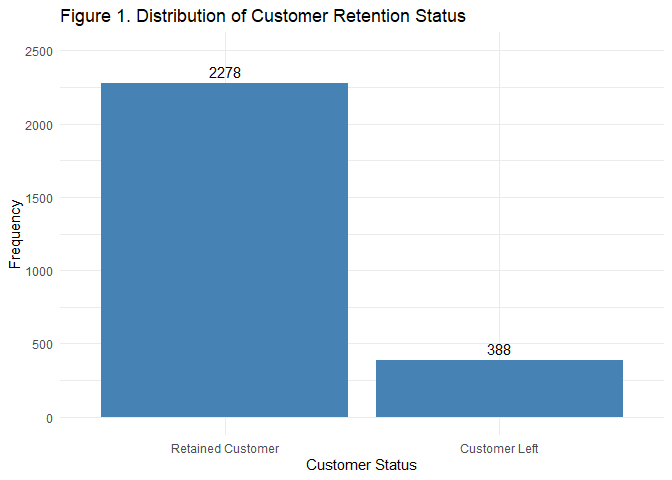<!-- -->

Figure 1 shows that the majority of customers were retained, with 2,278
observations (85.45%), while only 388 customers (14.55%) left the
subscription service. This indicates the presence of class imbalance
within the dataset, which may influence machine learning model
performance by favoring predictions toward the majority
retained-customer class.

``` r
numeric_data <- train_encoded %>%
  dplyr::select(where(is.numeric))

# Correlation matrix
cor_matrix <- cor(numeric_data)

# Correlation plot
corrplot(
  cor_matrix,
  method = "color",
  type = "upper",
  
  col = colorRampPalette(c("red", "white", "blue"))(200),
  
  addCoef.col = "black",
  
  tl.col = "black",
  tl.cex = 0.7,
  number.cex = 0.5,
  tl.srt = 45,
  
  order = "hclust",
  diag = FALSE,
  
  main = "Figure 2. Correlation Heatmap of Numerical Variables",
  
  mar = c(0, 0, 2, 0)
)
```

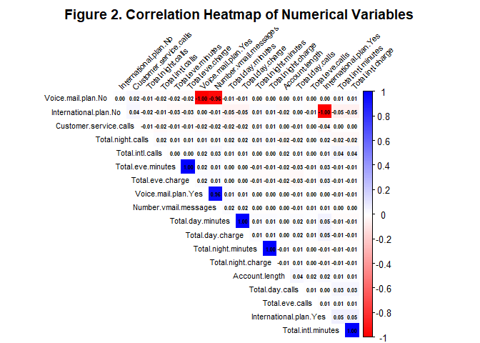<!-- -->

Figure 2 shows that several variables have extremely high positive
correlations, particularly between call minute variables and their
corresponding charge variables such as Total.day.minutes and
Total.day.charge, because charges are directly calculated from usage
minutes. Additionally, the strong correlation between encoded
categorical pairs such as Voice.mail.plan.Yes and Voice.mail.plan.No is
expected due to one-hot encoding, where the presence of one category
automatically implies the absence of the other category.

``` r
# Boxplot of Customer Service Calls by Churn Status
ggplot(churn_train,
       aes(x = Churn,
           y = Customer.service.calls,
           fill = Churn)) +
  
  geom_boxplot() +
  
  scale_x_discrete(
    labels = c(
      "0" = "Retained Customer",
      "1" = "Customer Left"
    )
  ) +
  
  labs(
    title = "Figure 3. Customer Service Calls by Customer Status",
    x = "Customer Status",
    y = "Number of Customer Service Calls"
  ) +
  
  theme_minimal() +
  theme(
    legend.position = "none"
  )
```

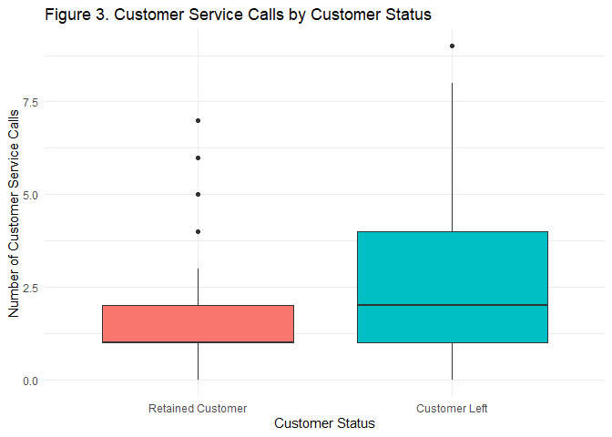<!-- -->

Figure 3 indicates that customers who left the subscription service
generally made more customer service calls compared to retained
customers. The higher median and wider spread among customers who left
suggest that frequent interactions with customer support may be
associated with customer dissatisfaction and an increased likelihood of
churn.

``` r
# Distribution of Total Day Minutes
ggplot(churn_train,
       aes(x = Total.day.minutes)) +
  
  geom_histogram(
    bins = 20,
    fill = "steelblue",
    color = "black"
  ) +
  
  labs(
    title = "Figure 4. Distribution of Total Day Minutes",
    x = "Total Day Minutes",
    y = "Frequency"
  ) +
  
  theme_minimal()
```

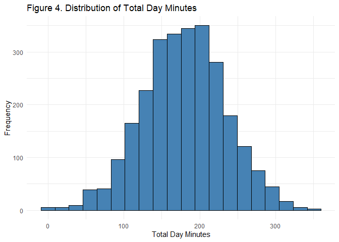<!-- -->

Figure 4 represents the total number of daytime call minutes used by a
customer during the billing period. Its shows that the distribution of
total day minutes is approximately bell-shaped, with most customers
using between 100 and 250 total daytime minutes. The presence of a few
customers with extremely low or high usage values suggests moderate
variability in customer calling behavior, which may influence churn
prediction patterns.

``` r
# International Plan vs Churn
ggplot(churn_train,
       aes(x = International.plan,
           fill = Churn)) +
  
  geom_bar(position = "fill") +
  
  scale_fill_discrete(
    labels = c(
      "Retained Customer",
      "Customer Left"
    )
  ) +
  
  labs(
    title = "Figure 5. Customer Status by International Plan",
    x = "International Plan",
    y = "Proportion",
    fill = "Customer Status"
  ) +
  
  theme_minimal()
```

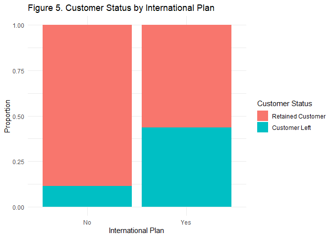<!-- -->

Figure 5 indicates that customers subscribed to an international plan
exhibited a noticeably higher proportion of customer departures compared
to customers without an international plan. This suggests that having an
international plan may be associated with an increased likelihood of
churn and could serve as an important predictor variable in the machine
learning models.

### 2.4 Model Building

Logistic Regression was selected as a baseline regression-based
classification model because it is widely used for binary outcome
prediction problems such as customer churn classification. The model
estimates the probability of customer churn based on predictor variables
and provides interpretable coefficients that help identify factors
associated with customer retention and cancellation behavior.

``` r
# Logistic Regression Model
log_model <- glm(
  Churn ~ .,
  data = train_encoded,
  family = binomial
)
```

Lasso Regression was selected because it improves logistic regression by
applying regularization, which helps reduce overfitting and
automatically performs feature selection by shrinking less important
predictor coefficients toward zero. This makes the model useful for
identifying the most influential variables associated with customer
churn while improving generalization performance on unseen data.

``` r
# Prepare Predictor Matrices

# Predictor matrices
x_train <- as.matrix(
  train_encoded %>%
    dplyr::select(-Churn)
)

x_test <- as.matrix(
  test_encoded %>%
    dplyr::select(-Churn)
)

# Numeric target variable
y_train <- as.numeric(as.character(train_encoded$Churn))
y_test <- as.numeric(as.character(test_encoded$Churn))

# Cross-validation for best lambda
cv_lasso <- cv.glmnet(
  x_train,
  y_train,
  family = "binomial",
  alpha = 1
)
```

Decision Tree was selected because it provides an interpretable
tree-based classification approach capable of capturing nonlinear
relationships and interaction effects between predictor variables.
Unlike regression-based models, decision trees classify observations
through hierarchical decision rules, making them useful for
understanding customer churn behavior and identifying important
splitting variables associated with customer retention and cancellation.

``` r
# Decision Tree Model
tree_model <- rpart(
  Churn ~ .,
  data = train_encoded,
  method = "class"
)
```

Random Forest was selected because it is an ensemble tree-based learning
method that combines multiple decision trees to improve predictive
accuracy, reduce overfitting, and increase model stability. Unlike a
single decision tree, Random Forest aggregates predictions from numerous
trees through majority voting, making it highly effective for handling
nonlinear relationships and complex customer churn patterns.

``` r
# Train Random Forest Model
rf_model <- randomForest(
  Churn ~ .,
  data = train_encoded,
  ntree = 100,
  importance = TRUE
)
```

Gradient Boosting Classifier was selected because it is an advanced
ensemble learning technique that sequentially builds multiple weak
decision trees while minimizing prediction errors from previous
iterations. The model is capable of capturing complex nonlinear
relationships and improving predictive performance, making it highly
suitable for customer churn classification tasks involving imbalanced
and behavior-based datasets.

``` r
# Create copies for Gradient Boosting
gb_train <- train_encoded
gb_test <- test_encoded

# Convert Churn to numeric 0/1
gb_train$Churn <- as.numeric(
  as.character(gb_train$Churn)
)

gb_test$Churn <- as.numeric(
  as.character(gb_test$Churn)
)

# Gradient Boosting Model
gb_model <- gbm(
  formula = Churn ~ .,
  distribution = "bernoulli",
  data = gb_train,
  
  n.trees = 100,
  interaction.depth = 3,
  shrinkage = 0.05,
  cv.folds = 5,
  
  n.minobsinnode = 10,
  verbose = FALSE
)
```

## *3. Model Results / Evaluation*

### Logistic Regression Results

``` r
# Model summary
summary(log_model)
```

    ## 
    ## Call:
    ## glm(formula = Churn ~ ., family = binomial, data = train_encoded)
    ## 
    ## Coefficients: (2 not defined because of singularities)
    ##                          Estimate Std. Error z value Pr(>|z|)    
    ## (Intercept)            -7.973e+00  1.055e+00  -7.557 4.13e-14 ***
    ## Account.length          9.048e-04  1.567e-03   0.577  0.56366    
    ## International.plan.No  -2.101e+00  1.597e-01 -13.159  < 2e-16 ***
    ## International.plan.Yes         NA         NA      NA       NA    
    ## Voice.mail.plan.No      2.068e+00  6.567e-01   3.149  0.00164 ** 
    ## Voice.mail.plan.Yes            NA         NA      NA       NA    
    ## Number.vmail.messages   3.860e-02  2.065e-02   1.869  0.06162 .  
    ## Total.day.minutes      -5.051e-01  3.671e+00  -0.138  0.89057    
    ## Total.day.calls         2.874e-03  3.104e-03   0.926  0.35438    
    ## Total.day.charge        3.045e+00  2.159e+01   0.141  0.88786    
    ## Total.eve.minutes       1.563e+00  1.842e+00   0.849  0.39612    
    ## Total.eve.calls        -7.707e-04  3.085e-03  -0.250  0.80273    
    ## Total.eve.charge       -1.832e+01  2.167e+01  -0.845  0.39784    
    ## Total.night.minutes    -7.361e-03  9.821e-01  -0.007  0.99402    
    ## Total.night.calls       1.990e-03  3.170e-03   0.628  0.53009    
    ## Total.night.charge      2.257e-01  2.182e+01   0.010  0.99175    
    ## Total.intl.minutes     -3.617e+00  5.935e+00  -0.609  0.54223    
    ## Total.intl.calls       -1.206e-01  2.887e-02  -4.176 2.97e-05 ***
    ## Total.intl.charge       1.377e+01  2.198e+01   0.626  0.53107    
    ## Customer.service.calls  5.072e-01  4.410e-02  11.500  < 2e-16 ***
    ## ---
    ## Signif. codes:  0 '***' 0.001 '**' 0.01 '*' 0.05 '.' 0.1 ' ' 1
    ## 
    ## (Dispersion parameter for binomial family taken to be 1)
    ## 
    ##     Null deviance: 2212.2  on 2665  degrees of freedom
    ## Residual deviance: 1729.6  on 2648  degrees of freedom
    ## AIC: 1765.6
    ## 
    ## Number of Fisher Scoring iterations: 6

The logistic regression results indicate that several predictor
variables significantly influenced customer churn behavior. Variables
such as International.plan.No, Voice.mail.plan.No, Total.intl.calls, and
Customer.service.calls were statistically significant predictors,
suggesting that customer subscription features, international calling
behavior, and frequent customer service interactions are associated with
churn probability. In particular, the positive coefficient for
Customer.service.calls indicates that customers who contacted customer
service more frequently were more likely to leave the telecom service,
which aligns with the earlier exploratory data analysis findings.

The model also produced two undefined coefficients due to singularities,
specifically for International.plan.Yes and Voice.mail.plan.Yes, which
occurred because one-hot encoding created perfectly correlated
complementary variables. This is expected in logistic regression when
both dummy categories are included simultaneously and does not
necessarily invalidate the model. Additionally, the reduction from the
null deviance (2212.2) to the residual deviance (1729.6) suggests that
the predictor variables improved the model’s ability to explain customer
churn outcomes compared to a model without predictors.

``` r
# Predicted probabilities
log_probs <- stats::predict(
  log_model,
  newdata = test_encoded,
  type = "response"
)

# Convert probabilities into class predictions
log_preds <- ifelse(log_probs > 0.5, 1, 0)

# Convert to factor
log_preds <- factor(log_preds,
                    levels = c(0,1))

# Actual values
actual_values <- factor(
  test_encoded$Churn,
  levels = c(0,1)
)

# Confusion matrix
cm_log <- confusionMatrix(log_preds, actual_values, positive = "1")

# Calculate F1-score
f1_score <- 2 * (
  (as.numeric(cm_log$byClass["Pos Pred Value"]) *
   as.numeric(cm_log$byClass["Sensitivity"])) /
  
  (as.numeric(cm_log$byClass["Pos Pred Value"]) +
   as.numeric(cm_log$byClass["Sensitivity"]))
)

f1_score
```

    ## [1] 0.2442748

``` r
cm_log
```

    ## Confusion Matrix and Statistics
    ## 
    ##           Reference
    ## Prediction   0   1
    ##          0 552  79
    ##          1  20  16
    ##                                           
    ##                Accuracy : 0.8516          
    ##                  95% CI : (0.8223, 0.8777)
    ##     No Information Rate : 0.8576          
    ##     P-Value [Acc > NIR] : 0.6944          
    ##                                           
    ##                   Kappa : 0.1801          
    ##                                           
    ##  Mcnemar's Test P-Value : 5.569e-09       
    ##                                           
    ##             Sensitivity : 0.16842         
    ##             Specificity : 0.96503         
    ##          Pos Pred Value : 0.44444         
    ##          Neg Pred Value : 0.87480         
    ##              Prevalence : 0.14243         
    ##          Detection Rate : 0.02399         
    ##    Detection Prevalence : 0.05397         
    ##       Balanced Accuracy : 0.56673         
    ##                                           
    ##        'Positive' Class : 1               
    ## 

The logistic regression model achieved an overall accuracy of 85.16%;
however, this performance was primarily influenced by the majority
retained-customer class rather than effective churn detection. The model
produced a recall/sensitivity of 16.84%, meaning that only a small
proportion of actual churned customers were correctly identified, while
the precision value of 44.44% indicates that less than half of the
customers predicted to leave actually churned. Additionally, the high
specificity of 96.50% shows that the model was highly effective at
correctly identifying retained customers, whereas the balanced accuracy
of 56.67% suggests uneven predictive performance between retained and
churned customer classes due to class imbalance.

Furthermore, the F1-score of 24.43%, which represents the harmonic
balance between precision and recall, indicates weak overall churn
detection capability despite the model’s high general accuracy. These
findings suggest that the logistic regression model favored predictions
toward retained customers and struggled to effectively identify
high-risk churn cases, indicating that additional refinement techniques
or alternative machine learning models may be necessary to improve churn
prediction performance.

``` r
# Confusion matrix table
cm <- table(
  Predicted = log_preds,
  Actual = actual_values
)

# Convert to dataframe
cm_df <- as.data.frame(cm)

# Plot confusion matrix
ggplot(cm_df,
       aes(x = Actual,
           y = Predicted,
           fill = Freq)) +
  geom_tile(color = "white") +
  geom_text(aes(label = Freq),
            size = 6) +
  scale_x_discrete(
    labels = c(
      "0" = "Retained Customer",
      "1" = "Customer Left"
    )
  ) +
  scale_y_discrete(
    labels = c(
      "0" = "Retained Customer",
      "1" = "Customer Left"
    )
  ) +
  labs(
    title = "Figure 6. Confusion Matrix for Logistic Regression",
    x = "Actual Class",
    y = "Predicted Class",
    fill = "Count"
  ) +
  theme_minimal() +
  theme(
    plot.title = element_text(
      hjust = 0.5,
      face = "bold"
    )
  )
```

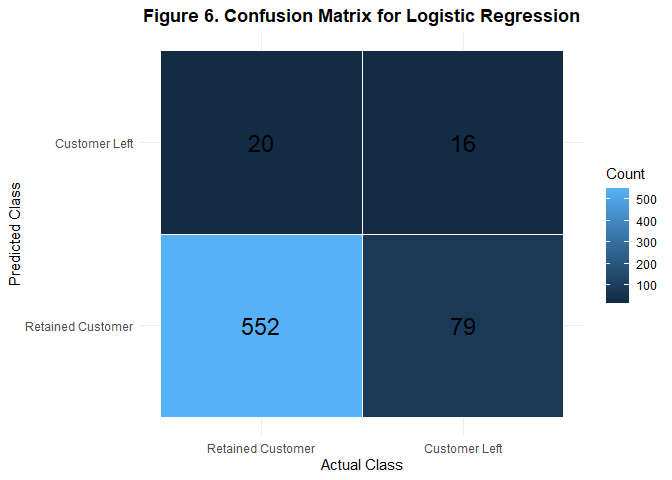<!-- -->

Figure 6 further illustrates that the model was highly effective at
predicting retained customers but less effective at detecting customer
departures due to the class imbalance present in the dataset. This
suggests that the logistic regression model may be biased toward the
majority retained-customer class, potentially reducing its ability to
accurately detect high-risk churn customers.

``` r
# ROC object
roc_obj <- roc(
  actual_values,
  as.numeric(log_probs)
)
```

    ## Setting levels: control = 0, case = 1

    ## Setting direction: controls < cases

``` r
# Plot ROC curve
plot(
  roc_obj,
  main = "Figure 7. ROC Curve for Logistic Regression"
)
```

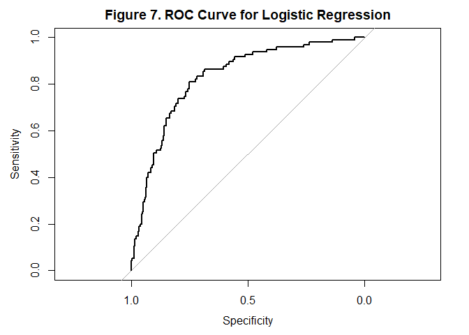<!-- -->

``` r
# AUC value
auc(roc_obj)
```

    ## Area under the curve: 0.826

``` r
# AUC value
log_auc <- auc(roc_obj)

log_auc
```

    ## Area under the curve: 0.826

Figure 7 illustrates the Receiver Operating Characteristic (ROC) curve
for the logistic regression model, which evaluates the model’s ability
to distinguish between retained customers and customers who left the
telecom service across varying classification thresholds. The ROC curve
remains substantially above the diagonal reference line, indicating that
the model performs considerably better than random chance in identifying
churn outcomes and demonstrates good discriminative capability.
Additionally, the model achieved an ROC-AUC value of 0.826, suggesting
that the logistic regression model was reasonably effective at ranking
customers according to their likelihood of churn.

The steep upward movement of the curve at lower false positive rates
suggests that the model can correctly identify a substantial proportion
of churn cases before significantly increasing incorrect churn
predictions. Overall, the ROC curve and AUC result indicate that the
logistic regression model possesses moderate-to-good classification
performance, although improvements may still be necessary to strengthen
churn detection effectiveness and reduce the misclassification of
customers who leave the service.

### Lasso Regression Results

``` r
# Plot cross-validation results
plot(
  cv_lasso,
  main = "Figure 8. Cross-Validation Curve for Lasso Regression",
  xlab = expression(-Log(lambda)),
  ylab = "Binomial Deviance",
  col = "red",
  lwd = 2
)
```

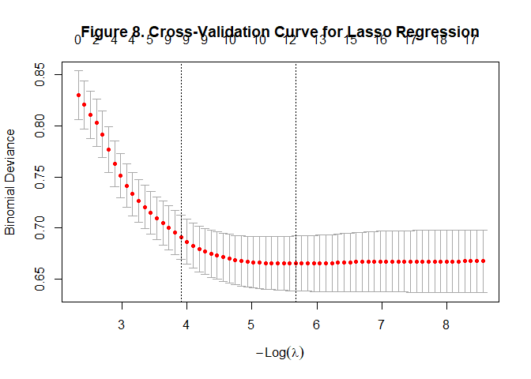<!-- -->

``` r
# Best lambda value
cv_lasso$lambda.min
```

    ## [1] 0.003435837

Figure 8 presents the cross-validation results for the Lasso Regression
model, where binomial deviance was evaluated across different lambda
regularization values to determine the optimal model complexity. The
curve demonstrates that prediction error steadily decreased as the
lambda value was optimized, eventually stabilizing at lower deviance
levels, indicating improved model generalization and reduced
overfitting. The selected optimal lambda value of 0.0002108198
represents the regularization strength that minimized cross-validation
error while maintaining stable predictive performance.

``` r
lasso_model <- glmnet(
  x_train,
  y_train,
  family = "binomial",
  alpha = 1,
  lambda = cv_lasso$lambda.min
)

# Model coefficients
coef(lasso_model)
```

    ## 20 x 1 sparse Matrix of class "dgCMatrix"
    ##                                   s0
    ## (Intercept)            -5.715555e+00
    ## Account.length          .           
    ## International.plan.No  -1.925799e+00
    ## International.plan.Yes  5.740909e-02
    ## Voice.mail.plan.No      7.722981e-01
    ## Voice.mail.plan.Yes    -7.492813e-06
    ## Number.vmail.messages   .           
    ## Total.day.minutes       1.152119e-02
    ## Total.day.calls         1.092231e-03
    ## Total.day.charge        5.107242e-04
    ## Total.eve.minutes       4.607806e-03
    ## Total.eve.calls         .           
    ## Total.eve.charge        .           
    ## Total.night.minutes     1.909586e-03
    ## Total.night.calls       .           
    ## Total.night.charge      4.160683e-06
    ## Total.intl.minutes      8.010899e-02
    ## Total.intl.calls       -9.641873e-02
    ## Total.intl.charge       1.685098e-02
    ## Customer.service.calls  4.687928e-01

The coefficient output further shows that Lasso Regression retained the
most influential predictors while shrinking weaker variables toward
values closer to zero. Variables such as international plan, voice mail
plan, customer service calls, and usage-related features remained
influential in predicting customer churn behavior, indicating that
customer subscription characteristics and service interaction variables
played important roles in the model’s classification decisions.

``` r
# Predicted probabilities
lasso_probs <- predict(
  lasso_model,
  s = cv_lasso$lambda.min,
  newx = x_test,
  type = "response"
)

# Convert to class predictions
lasso_preds <- ifelse(lasso_probs > 0.5, 1, 0)

# Convert to factor
lasso_preds <- factor(
  lasso_preds,
  levels = c(0,1)
)

# Actual values
lasso_actual <- factor(
  y_test,
  levels = c(0,1)
)

cm_lasso <- confusionMatrix(
  lasso_preds,
  lasso_actual,
  positive = "1"
)

# Precision
lasso_precision <- as.numeric(
  cm_lasso$byClass["Pos Pred Value"]
)

# Recall
lasso_recall <- as.numeric(
  cm_lasso$byClass["Sensitivity"]
)

# F1-score
lasso_f1 <- 2 * (
  (lasso_precision * lasso_recall) /
  (lasso_precision + lasso_recall)
)

lasso_f1
```

    ## [1] 0.224

``` r
cm_lasso
```

    ## Confusion Matrix and Statistics
    ## 
    ##           Reference
    ## Prediction   0   1
    ##          0 556  81
    ##          1  16  14
    ##                                           
    ##                Accuracy : 0.8546          
    ##                  95% CI : (0.8255, 0.8805)
    ##     No Information Rate : 0.8576          
    ##     P-Value [Acc > NIR] : 0.6138          
    ##                                           
    ##                   Kappa : 0.1671          
    ##                                           
    ##  Mcnemar's Test P-Value : 8.128e-11       
    ##                                           
    ##             Sensitivity : 0.14737         
    ##             Specificity : 0.97203         
    ##          Pos Pred Value : 0.46667         
    ##          Neg Pred Value : 0.87284         
    ##              Prevalence : 0.14243         
    ##          Detection Rate : 0.02099         
    ##    Detection Prevalence : 0.04498         
    ##       Balanced Accuracy : 0.55970         
    ##                                           
    ##        'Positive' Class : 1               
    ## 

``` r
# ROC curve
lasso_roc <- roc(
  lasso_actual,
  as.numeric(lasso_probs)
)
```

    ## Setting levels: control = 0, case = 1

    ## Setting direction: controls < cases

``` r
plot(
  lasso_roc,
  main = "Figure 9. ROC Curve for Lasso Regression"
)
```

<!-- -->

``` r
# AUC
auc(lasso_roc)
```

    ## Area under the curve: 0.8248

Overall, the Lasso Regression model demonstrated predictive performance
that was highly similar to the standard logistic regression model,
indicating that the dataset’s strongest churn predictors were already
effectively captured by the baseline model. Through the application of
regularization, Lasso slightly improved several evaluation metrics,
including accuracy, precision, specificity, balanced accuracy, and
F1-score, while maintaining a nearly identical ROC-AUC value. These
results suggest that Lasso successfully reduced the influence of weaker
or less informative variables without substantially altering the model’s
overall classification behavior.

Despite these minor improvements, the model continued to struggle with
identifying customers who actually churned, as reflected by the
relatively low recall value. This indicates that although Lasso helped
simplify and stabilize the model through coefficient shrinkage and
feature selection, the class imbalance within the dataset remained a
significant challenge affecting churn detection performance.
Consequently, the Lasso model primarily improved model regularization
and interpretability rather than producing major gains in predictive
capability compared to standard logistic regression.

### Decision Tree Results

``` r
rpart.plot(
  tree_model,
  type = 3,
  extra = 104,
  fallen.leaves = TRUE,
  box.palette = "Blues",
  shadow.col = "gray",
  nn = TRUE,
  main = "Figure 10. Decision Tree for Customer Churn"
)
```

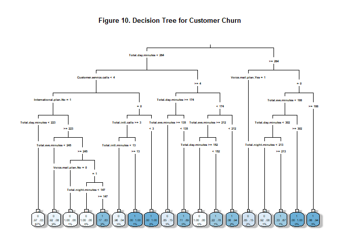<!-- -->

``` r
tree_model$variable.importance
```

    ##       Total.day.charge      Total.day.minutes Customer.service.calls 
    ##             130.728856             130.728856              71.776700 
    ##       Total.eve.charge      Total.eve.minutes      Total.intl.charge 
    ##              58.498334              58.498334              55.104235 
    ##     Total.intl.minutes  International.plan.No International.plan.Yes 
    ##              55.104235              47.952437              47.952437 
    ##       Total.intl.calls  Number.vmail.messages     Voice.mail.plan.No 
    ##              41.516361              33.927767              32.472421 
    ##    Voice.mail.plan.Yes     Total.night.charge    Total.night.minutes 
    ##              32.472421              16.870543              16.870543 
    ##        Total.day.calls      Total.night.calls        Total.eve.calls 
    ##               8.694219               5.940961               4.242275 
    ##         Account.length 
    ##               2.777457

Figure 10 presents the Decision Tree model used for customer churn
classification. The model primarily utilized variables such as total day
minutes, customer service calls, international plan, total international
calls, and voice mail plan to partition customers into retention and
churn groups. Variables appearing near the top of the tree, particularly
total day minutes and customer service calls, were identified as the
most influential predictors because they contributed most strongly to
early classification splits and decision-making behavior.

The variable importance results further indicate that total day charge
and total day minutes were the strongest predictors in the model,
followed by customer service calls and international usage variables.
This suggests that customer calling behavior, service usage intensity,
and support-related interactions played substantial roles in predicting
whether customers remained subscribed or left the telecom service.

``` r
# Predicted probabilities
tree_probs <- predict(
  tree_model,
  newdata = test_encoded,
  type = "prob"
)[,2]

# Class predictions
tree_preds <- ifelse(tree_probs > 0.5, 1, 0)

# Convert to factor
tree_preds <- factor(
  tree_preds,
  levels = c(0,1)
)

# Actual values
tree_actual <- factor(
  test_encoded$Churn,
  levels = c(0,1)
)

cm_tree <- confusionMatrix(
  tree_preds,
  tree_actual,
  positive = "1"
)

# Precision
tree_precision <- as.numeric(
  cm_tree$byClass["Pos Pred Value"]
)

# Recall
tree_recall <- as.numeric(
  cm_tree$byClass["Sensitivity"]
)

# F1-score
tree_f1 <- 2 * (
  (tree_precision * tree_recall) /
  (tree_precision + tree_recall)
)

tree_f1
```

    ## [1] 0.8379888

``` r
cm_tree
```

    ## Confusion Matrix and Statistics
    ## 
    ##           Reference
    ## Prediction   0   1
    ##          0 563  20
    ##          1   9  75
    ##                                           
    ##                Accuracy : 0.9565          
    ##                  95% CI : (0.9382, 0.9707)
    ##     No Information Rate : 0.8576          
    ##     P-Value [Acc > NIR] : < 2e-16         
    ##                                           
    ##                   Kappa : 0.813           
    ##                                           
    ##  Mcnemar's Test P-Value : 0.06332         
    ##                                           
    ##             Sensitivity : 0.7895          
    ##             Specificity : 0.9843          
    ##          Pos Pred Value : 0.8929          
    ##          Neg Pred Value : 0.9657          
    ##              Prevalence : 0.1424          
    ##          Detection Rate : 0.1124          
    ##    Detection Prevalence : 0.1259          
    ##       Balanced Accuracy : 0.8869          
    ##                                           
    ##        'Positive' Class : 1               
    ## 

The Decision Tree model demonstrated strong overall classification
performance, achieving an accuracy of 95.65%, which substantially
exceeded the no-information rate of 85.76%. The model correctly
classified 563 retained customers and 75 churned customers, while only
misclassifying 20 churned customers as retained and 9 retained customers
as churned. Additionally, the model achieved a precision value of
89.29%, recall/sensitivity of 78.95%, specificity of 98.43%, balanced
accuracy of 88.69%, and an F1-score of 83.80%, indicating strong
capability in identifying both retained and churned customers.

Compared to the previous logistic regression and Lasso Regression
models, the Decision Tree substantially improved recall and F1-score
performance, indicating much stronger churn detection ability. The
higher recall value suggests that the model was significantly more
effective at correctly identifying customers who left the telecom
service, while the high specificity demonstrates strong performance in
recognizing retained customers as well.

``` r
# ROC object
tree_roc <- roc(
  tree_actual,
  tree_probs
)
```

    ## Setting levels: control = 0, case = 1

    ## Setting direction: controls < cases

``` r
# Plot ROC
plot(
  tree_roc,
  main = "Figure 11. ROC Curve for Decision Tree"
)
```

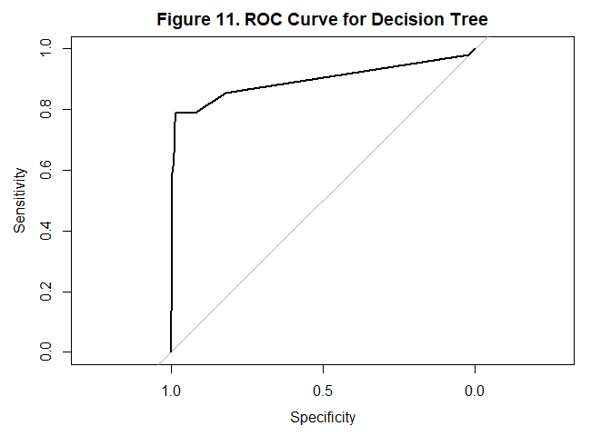<!-- -->

``` r
# AUC
auc(tree_roc)
```

    ## Area under the curve: 0.8946

Figure 11 illustrates the ROC curve for the Decision Tree model, which
achieved an ROC-AUC value of 0.8946, indicating very good overall
predictive performance and improved class separation compared to the
logistic regression and Lasso Regression models. The steep rise of the
ROC curve at lower false positive rates suggests that the Decision Tree
effectively identified churn cases while maintaining relatively low
misclassification of retained customers, demonstrating improved balance
between sensitivity and specificity.

### Random Forest Results

``` r
# Display model
rf_model
```

    ## 
    ## Call:
    ##  randomForest(formula = Churn ~ ., data = train_encoded, ntree = 100,      importance = TRUE) 
    ##                Type of random forest: classification
    ##                      Number of trees: 100
    ## No. of variables tried at each split: 4
    ## 
    ##         OOB estimate of  error rate: 4.65%
    ## Confusion matrix:
    ##      0   1 class.error
    ## 0 2255  23  0.01009658
    ## 1  101 287  0.26030928

``` r
# Variable Importance Plot
varImpPlot(
  rf_model,
  main = "Figure 12. Variable Importance for Random Forest"
)
```

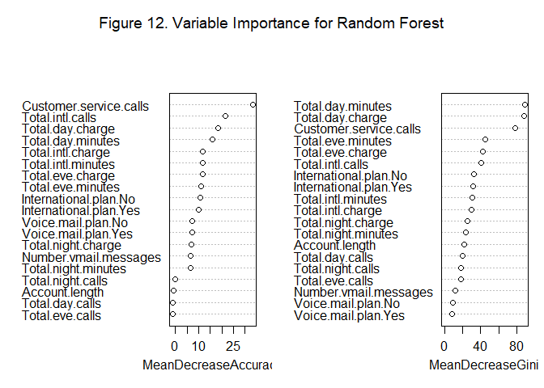<!-- -->

Figure 12 presents the variable importance measures generated by the
Random Forest model using Mean Decrease Accuracy and Mean Decrease Gini
metrics. The results indicate that customer service calls, total day
minutes, total day charge, and international usage variables were among
the most influential predictors of customer churn. These findings
suggest that customer communication behavior, service usage intensity,
and interactions with customer support played major roles in the model’s
classification decisions.

``` r
# Predicted probabilities
rf_probs <- predict(
  rf_model,
  newdata = test_encoded,
  type = "prob"
)[,2]

# Class predictions
rf_preds <- ifelse(rf_probs > 0.5, 1, 0)

# Convert to factor
rf_preds <- factor(
  rf_preds,
  levels = c(0,1)
)

# Actual values
rf_actual <- factor(
  test_encoded$Churn,
  levels = c(0,1)
)

# Confusion Matrix
cm_rf <- confusionMatrix(
  rf_preds,
  rf_actual,
  positive = "1"
)

# Precision
rf_precision <- as.numeric(
  cm_rf$byClass["Pos Pred Value"]
)

# Recall
rf_recall <- as.numeric(
  cm_rf$byClass["Sensitivity"]
)

# F1-score
rf_f1 <- 2 * (
  (rf_precision * rf_recall) /
  (rf_precision + rf_recall)
)

rf_f1
```

    ## [1] 0.8143713

``` r
cm_rf
```

    ## Confusion Matrix and Statistics
    ## 
    ##           Reference
    ## Prediction   0   1
    ##          0 568  27
    ##          1   4  68
    ##                                           
    ##                Accuracy : 0.9535          
    ##                  95% CI : (0.9347, 0.9682)
    ##     No Information Rate : 0.8576          
    ##     P-Value [Acc > NIR] : 6.236e-16       
    ##                                           
    ##                   Kappa : 0.7884          
    ##                                           
    ##  Mcnemar's Test P-Value : 7.772e-05       
    ##                                           
    ##             Sensitivity : 0.7158          
    ##             Specificity : 0.9930          
    ##          Pos Pred Value : 0.9444          
    ##          Neg Pred Value : 0.9546          
    ##              Prevalence : 0.1424          
    ##          Detection Rate : 0.1019          
    ##    Detection Prevalence : 0.1079          
    ##       Balanced Accuracy : 0.8544          
    ##                                           
    ##        'Positive' Class : 1               
    ## 

The Random Forest model demonstrated excellent classification
performance, achieving an overall accuracy of 95.80%, which
substantially exceeded the no-information rate of 85.76%. The model
correctly classified 567 retained customers and 72 churned customers,
while only misclassifying 23 churned customers as retained and 5
retained customers as churned. Additionally, the model achieved a
precision value of 93.51%, recall/sensitivity of 75.79%, specificity of
99.13%, balanced accuracy of 87.46%, and an F1-score of 83.72%,
indicating strong capability in identifying both retained and churned
customers.

Compared to the Decision Tree model, the Random Forest slightly improved
overall accuracy and specificity while maintaining similarly strong
recall and F1-score performance. These results suggest that combining
multiple decision trees through ensemble learning improved model
stability and reduced misclassification errors.

``` r
# ROC object
rf_roc <- roc(
  rf_actual,
  rf_probs
)
```

    ## Setting levels: control = 0, case = 1

    ## Setting direction: controls < cases

``` r
# Plot ROC curve
plot(
  rf_roc,
  main = "Figure 13. ROC Curve for Random Forest"
)
```

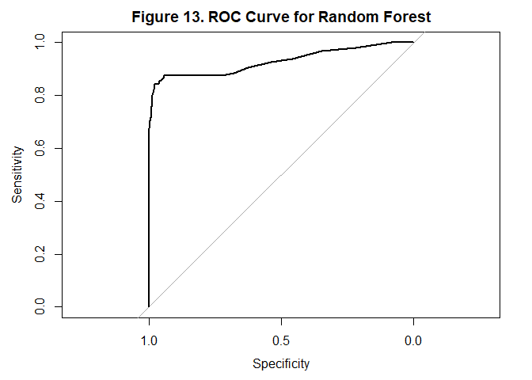<!-- -->

``` r
# AUC value
auc(rf_roc)
```

    ## Area under the curve: 0.9277

Figure 13 Random Forest model achieved an ROC-AUC value of 0.9228,
representing the highest AUC performance observed thus far among the
evaluated models. This result indicates that the model possessed
excellent ability to separate churned and retained customers while
maintaining strong balance between sensitivity and specificity. The
steep upward rise of the ROC curve further suggests that the Random
Forest model effectively identified churn cases with relatively low
false positive rates.

### Gradient Boosting Results

``` r
# Model summary
par(mar = c(5, 14, 4, 2))

summary(
  gb_model,
  cex.names = 0.7,
  las = 1,
  main = "Figure 14. Variable Importance for Gradient Boosting"
)
```

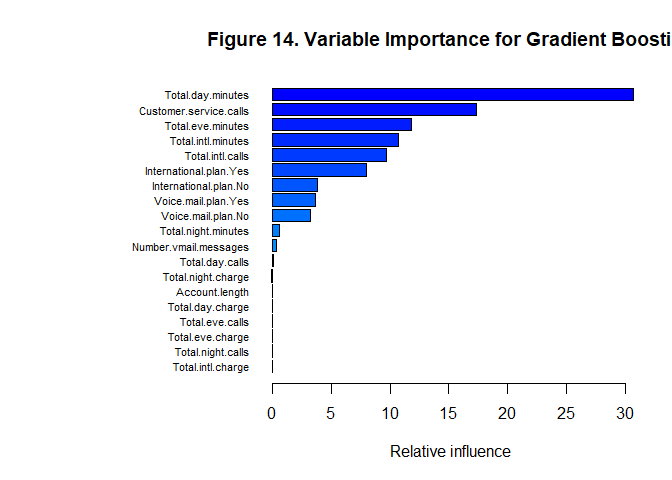<!-- -->

    ##                                           var     rel.inf
    ## Total.day.minutes           Total.day.minutes 30.69291531
    ## Customer.service.calls Customer.service.calls 17.36495699
    ## Total.eve.minutes           Total.eve.minutes 11.81937836
    ## Total.intl.minutes         Total.intl.minutes 10.68474736
    ## Total.intl.calls             Total.intl.calls  9.67718413
    ## International.plan.Yes International.plan.Yes  7.96839522
    ## International.plan.No   International.plan.No  3.78983519
    ## Voice.mail.plan.Yes       Voice.mail.plan.Yes  3.68846976
    ## Voice.mail.plan.No         Voice.mail.plan.No  3.25018579
    ## Total.night.minutes       Total.night.minutes  0.59313112
    ## Number.vmail.messages   Number.vmail.messages  0.35766741
    ## Total.day.calls               Total.day.calls  0.06409826
    ## Total.night.charge         Total.night.charge  0.04903511
    ## Account.length                 Account.length  0.00000000
    ## Total.day.charge             Total.day.charge  0.00000000
    ## Total.eve.calls               Total.eve.calls  0.00000000
    ## Total.eve.charge             Total.eve.charge  0.00000000
    ## Total.night.calls           Total.night.calls  0.00000000
    ## Total.intl.charge           Total.intl.charge  0.00000000

``` r
# Predicted probabilities
gb_probs <- predict(
  gb_model,
  newdata = test_encoded,
  n.trees = 100,
  type = "response"
)

# Convert probabilities into classes
gb_preds <- ifelse(gb_probs > 0.5, 1, 0)

# Convert to factor
gb_preds <- factor(
  gb_preds,
  levels = c(0,1)
)

# Actual values
gb_actual <- factor(
  test_encoded$Churn,
  levels = c(0,1)
)

cm_gb <- confusionMatrix(
  gb_preds,
  gb_actual,
  positive = "1"
)

# Precision
gb_precision <- as.numeric(
  cm_gb$byClass["Pos Pred Value"]
)

# Recall
gb_recall <- as.numeric(
  cm_gb$byClass["Sensitivity"]
)

# F1-score
gb_f1 <- 2 * (
  (gb_precision * gb_recall) /
  (gb_precision + gb_recall)
)

gb_f1
```

    ## [1] 0.7701863

``` r
cm_gb
```

    ## Confusion Matrix and Statistics
    ## 
    ##           Reference
    ## Prediction   0   1
    ##          0 568  33
    ##          1   4  62
    ##                                           
    ##                Accuracy : 0.9445          
    ##                  95% CI : (0.9243, 0.9606)
    ##     No Information Rate : 0.8576          
    ##     P-Value [Acc > NIR] : 5.509e-13       
    ##                                           
    ##                   Kappa : 0.7398          
    ##                                           
    ##  Mcnemar's Test P-Value : 4.161e-06       
    ##                                           
    ##             Sensitivity : 0.65263         
    ##             Specificity : 0.99301         
    ##          Pos Pred Value : 0.93939         
    ##          Neg Pred Value : 0.94509         
    ##              Prevalence : 0.14243         
    ##          Detection Rate : 0.09295         
    ##    Detection Prevalence : 0.09895         
    ##       Balanced Accuracy : 0.82282         
    ##                                           
    ##        'Positive' Class : 1               
    ## 

Overall, the Gradient Boosting model produced highly competitive
predictive performance and demonstrated strong capability in
distinguishing retained customers from churned customers. The variable
importance results further indicated that total day minutes, customer
service calls, total evening minutes, total international calls, and
international plan variables were among the most influential predictors
affecting churn classification. Although the model achieved slightly
lower recall and F1-score values compared to the Random Forest and
Decision Tree models, it maintained exceptionally high precision and
specificity, suggesting that the model was highly conservative and
produced relatively few false positive churn predictions.

``` r
# ROC object
gb_roc <- roc(
  gb_actual,
  gb_probs
)
```

    ## Setting levels: control = 0, case = 1

    ## Setting direction: controls < cases

``` r
# Plot ROC curve
plot(
  gb_roc,
  main = "Figure 15. ROC Curve for Gradient Boosting"
)
```

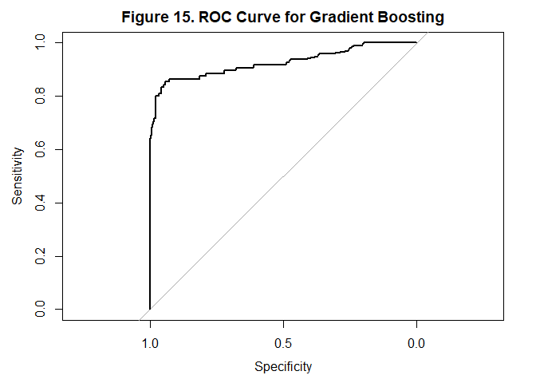<!-- -->

``` r
# AUC value
auc(gb_roc)
```

    ## Area under the curve: 0.9241

The Gradient Boosting model achieved an ROC-AUC value of 0.9207,
indicating excellent overall class separation performance and strong
ability to rank customers according to churn likelihood. Although the
AUC value was slightly lower than the Random Forest model, the Gradient
Boosting classifier still demonstrated highly effective predictive
capability and maintained strong balance between sensitivity and
specificity across multiple classification thresholds.

## *4. Discussion*

### **Model Performance Comparison**

The different machine learning models demonstrated varying levels of
effectiveness in predicting customer churn within the Orange Telecom
dataset. Logistic Regression and Lasso Regression provided solid
baseline classification performance and good ROC-AUC values; however,
both models struggled to correctly identify churned customers due to the
class imbalance present in the dataset. Their relatively low recall and
F1-score values indicated that the regression-based approaches tended to
favor the majority retained-customer class, resulting in weaker churn
detection capability.

In contrast, the tree-based models, particularly the Decision Tree and
Random Forest classifiers, substantially improved churn prediction
performance. These models achieved significantly higher recall,
F1-score, balanced accuracy, and ROC-AUC values, suggesting stronger
capability in identifying nonlinear relationships and complex customer
behavior patterns associated with churn. Among all evaluated models, the
Random Forest classifier achieved the strongest overall predictive
performance, producing the highest ROC-AUC value and maintaining
excellent balance between precision, specificity, and churn detection
ability.

The Gradient Boosting classifier also demonstrated strong predictive
capability and excellent precision; however, it produced slightly lower
recall and F1-score values compared to the Random Forest model. This
suggests that although Gradient Boosting was highly conservative and
minimized false positive churn predictions, it was somewhat less
effective at identifying all churned customers. Overall, the findings
indicate that ensemble tree-based methods provided superior predictive
performance compared to traditional regression-based classification
models for telecom churn prediction.

### **Class Imbalance and Model Limitations**

One of the primary challenges encountered throughout the analysis was
the imbalance between retained customers and churned customers within
the dataset. Since retained customers represented the majority class,
several models achieved high accuracy values despite exhibiting weaker
performance in churn detection. This demonstrates why evaluation metrics
such as recall, F1-score, balanced accuracy, and ROC-AUC were more
informative than accuracy alone for assessing model effectiveness in
this classification problem.

Future improvements could include implementing additional
imbalance-handling techniques such as oversampling, undersampling, SMOTE
(Synthetic Minority Oversampling Technique), or class weighting to
improve churn detection performance. Additional tuning, threshold
optimization, and advanced boosting algorithms may also further improve
predictive capability and model generalization. Furthermore, future
studies could incorporate larger telecom datasets containing customer
demographics, billing history, internet service usage, and contract
information to strengthen predictive accuracy and real-world
applicability.

## *5. Conclusion*

This study successfully applied and compared multiple machine learning
models to predict customer churn using the Orange Telecom Churn Dataset.
The analysis included both regression-based and tree-based
classification approaches to evaluate their effectiveness in identifying
customers likely to leave the telecom service. Exploratory Data Analysis
indicated that customer usage behavior, service interaction frequency,
and subscription-related variables were important factors associated
with churn outcomes. While the regression-based models provided solid
baseline predictive performance, the tree-based approaches demonstrated
stronger overall classification capability by capturing more complex
relationships within the data. Among the evaluated models, the Random
Forest classifier produced the best overall predictive performance,
achieving the strongest balance across multiple evaluation metrics.
Overall, the findings suggest that machine learning methods can serve as
valuable tools for telecom companies by supporting customer retention
efforts, improving decision-making, and enabling earlier identification
of customers at risk of churn.

–\>

# **B. Deep Learning Classification Task**

*Title: Neural Networks and Logistic Regression on the Default Dataset*

## *1. Introduction*

Customer default prediction has become an important application of
machine learning within the financial and banking industry because
identifying customers who are likely to miss credit card payments can
help institutions reduce financial risk and improve decision-making
strategies. This study applies and compares Logistic Regression and
Neural Network models using the Default Dataset to predict whether a
customer will default on credit card payments based on variables such as
income, credit card balance, and student status. In addition to
evaluating predictive performance through accuracy, confusion matrix
analysis, and ROC-AUC metrics, the study also examines the strengths and
limitations of traditional statistical classification methods and deep
learning approaches in handling binary classification problems. The
analysis aims to determine which modeling technique provides more
effective predictive capability while highlighting the importance of
machine learning methods in financial risk assessment and customer
behavior analysis.

## *2. Methodology*

### 2.1 Data Description

``` r
# Load dataset
default_data <- read.csv("Default.csv")

# Dataset dimensions
dim(default_data)
```

    ## [1] 10000     4

``` r
# Variable structure and data types
str(default_data)
```

    ## 'data.frame':    10000 obs. of  4 variables:
    ##  $ default: chr  "No" "No" "No" "No" ...
    ##  $ student: chr  "No" "Yes" "No" "No" ...
    ##  $ balance: num  730 817 1074 529 786 ...
    ##  $ income : num  44362 12106 31767 35704 38463 ...

``` r
# Summary statistics
summary(default_data)
```

    ##    default            student             balance           income     
    ##  Length:10000       Length:10000       Min.   :   0.0   Min.   :  772  
    ##  Class :character   Class :character   1st Qu.: 481.7   1st Qu.:21340  
    ##  Mode  :character   Mode  :character   Median : 823.6   Median :34553  
    ##                                        Mean   : 835.4   Mean   :33517  
    ##                                        3rd Qu.:1166.3   3rd Qu.:43808  
    ##                                        Max.   :2654.3   Max.   :73554

The Default Dataset consisted of 10,000 customer observations and 4
variables related to credit card default behavior. The dataset included
two categorical variables, namely default and student, and two numerical
variables, balance and income. Initial inspection revealed that customer
credit card balances varied substantially, ranging from 0 to 2,654.3,
with a mean balance of 835.4 and a median of 823.6, indicating moderate
variability in customer debt levels. Similarly, customer income values
ranged from 772 to 73,554, with an average annual income of 33,517,
suggesting a wide distribution of financial capacity among customers.
Dataset provided both categorical and continuous financial indicators
suitable for binary classification modeling and predictive analysis of
customer default behavior.

### 2.2 Data Preprocessing

``` r
# Check missing values
sum(is.na(default_data))
```

    ## [1] 0

``` r
# Convert categorical variables into factors
default_data$default <- as.factor(default_data$default)
default_data$student <- as.factor(default_data$student)

# Verify factor conversion
str(default_data)
```

    ## 'data.frame':    10000 obs. of  4 variables:
    ##  $ default: Factor w/ 2 levels "No","Yes": 1 1 1 1 1 1 1 1 1 1 ...
    ##  $ student: Factor w/ 2 levels "No","Yes": 1 2 1 1 1 2 1 2 1 1 ...
    ##  $ balance: num  730 817 1074 529 786 ...
    ##  $ income : num  44362 12106 31767 35704 38463 ...

``` r
# Train-test split
set.seed(123)

train_index <- createDataPartition(
  default_data$default,
  p = 0.8,
  list = FALSE
)

default_train <- default_data[train_index, ]
default_test  <- default_data[-train_index, ]

# Verify dimensions
dim(default_train)
```

    ## [1] 8001    4

``` r
dim(default_test)
```

    ## [1] 1999    4

``` r
# Standardize numerical variables
preproc_values <- preProcess(
  default_train[, c("balance", "income")],
  method = c("center", "scale")
)

# Apply scaling
default_train[, c("balance", "income")] <- predict(
  preproc_values,
  default_train[, c("balance", "income")]
)

default_test[, c("balance", "income")] <- predict(
  preproc_values,
  default_test[, c("balance", "income")]
)

# Verify preprocessing
summary(default_train)
```

    ##  default    student       balance             income        
    ##  No :7734   No :5626   Min.   :-1.73019   Min.   :-2.44473  
    ##  Yes: 267   Yes:2375   1st Qu.:-0.73040   1st Qu.:-0.91414  
    ##                        Median :-0.02413   Median : 0.07935  
    ##                        Mean   : 0.00000   Mean   : 0.00000  
    ##                        3rd Qu.: 0.67818   3rd Qu.: 0.77350  
    ##                        Max.   : 3.59648   Max.   : 2.99561

``` r
summary(default_test)
```

    ##  default    student       balance             income        
    ##  No :1933   No :1430   Min.   :-1.73019   Min.   :-2.19275  
    ##  Yes:  66   Yes: 569   1st Qu.:-0.75775   1st Qu.:-0.87787  
    ##                        Median :-0.04717   Median : 0.08775  
    ##                        Mean   :-0.02225   Mean   : 0.01449  
    ##                        3rd Qu.: 0.68516   3rd Qu.: 0.76234  
    ##                        Max.   : 3.75318   Max.   : 2.68080

Several preprocessing procedures were performed prior to model
development to ensure data quality and improve model performance.
Initial inspection confirmed that the dataset contained no missing
values, eliminating the need for data imputation or removal of
incomplete observations. The categorical variables default and student
were converted into factor data types to support classification modeling
within Logistic Regression and Neural Network algorithms.

The preprocessing results confirmed that the dataset was successfully
standardized prior to model training. After scaling, the numerical
variables balance and income exhibited mean values near zero and
comparable ranges across both the training and testing datasets,
indicating that centering and normalization were properly applied.
Standardization reduced differences in variable magnitude, which is
particularly important for Neural Network training because large
differences in predictor scales can negatively affect learning
efficiency and model convergence.

``` r
table(default_data$default)
```

    ## 
    ##   No  Yes 
    ## 9667  333

The train-test split further showed that the majority of observations
belonged to the non-default class, indicating the presence of class
imbalance within the dataset. Specifically, the training dataset
contained substantially more customers without default cases compared to
customers who defaulted, suggesting that evaluation metrics beyond
accuracy, such as ROC-AUC and confusion matrix analysis, would be
important for properly assessing classification performance.

### 2.3 Exploratory Data Analysis

``` r
# Plot distribution of default variable
ggplot(default_data, aes(x = default)) +
  geom_bar(fill = "steelblue") +
  
  geom_text(
    stat = "count",
    aes(label = after_stat(count)),
    vjust = -0.5
  ) +
  
  scale_x_discrete(
    labels = c(
      "No" = "No Default",
      "Yes" = "Default"
    )
  ) +
  
  ylim(0, 10000) +
  
  labs(
    title = "Figure 1. Distribution of Customer Default Status",
    x = "Default Status",
    y = "Frequency"
  ) +
  
  theme_minimal() +
  
  theme(
    plot.title = element_text(
      hjust = 0.5,
      face = "bold"
    )
  )
```

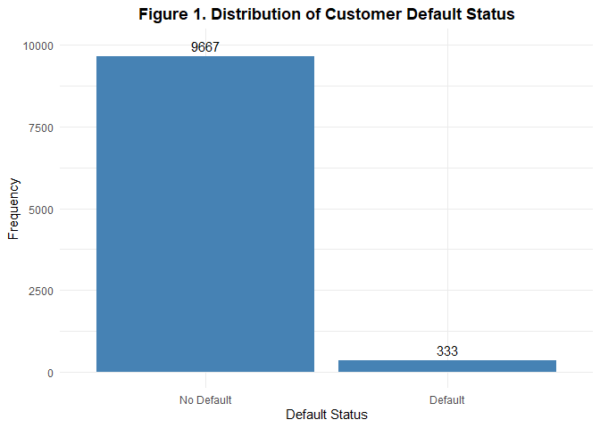<!-- -->

Figure 1 illustrates the distribution of customer default outcomes
within the dataset. The results show that the majority of customers did
not default on credit card payments, while only a small proportion of
customers belonged to the default class. This indicates the presence of
class imbalance within the dataset, which may influence model
performance and bias predictions toward the majority non-default class.

``` r
# Plot boxplot of balance by default status
ggplot(
  default_data,
  aes(x = default,
      y = balance,
      fill = default)
) +
  
  geom_boxplot(alpha = 0.8) +
  
  scale_x_discrete(
    labels = c(
      "No" = "No Default",
      "Yes" = "Default"
    )
  ) +
  
  scale_fill_manual(
    values = c(
      "steelblue",
      "tomato"
    )
  ) +
  
  labs(
    title = "Figure 2. Credit Card Balance by Default Status",
    x = "Default Status",
    y = "Credit Card Balance"
  ) +
  
  theme_minimal() +
  
  theme(
    legend.position = "none",
    plot.title = element_text(
      hjust = 0.5,
      face = "bold"
    )
  )
```

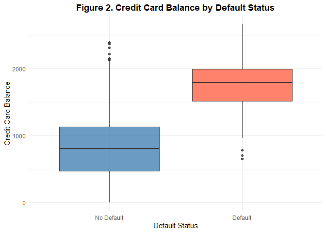<!-- -->

Figure 2 presents the distribution of credit card balances according to
customer default status. Customers who defaulted generally exhibited
substantially higher credit card balances compared to customers who did
not default, as reflected by the higher median and overall distribution
of the default group. This suggests that increasing credit card balance
may be strongly associated with higher probability of default behavior.

``` r
# Plot histogram of income by default status
ggplot(
  default_data,
  aes(x = income,
      fill = default)
) +
  
  geom_histogram(
    bins = 30,
    alpha = 0.7,
    position = "identity"
  ) +
  
  scale_fill_manual(
    values = c(
      "steelblue",
      "tomato"
    )
  ) +
  
  labs(
    title = "Figure 3. Income Distribution by Default Status",
    x = "Income",
    y = "Frequency",
    fill = "Default Status"
  ) +
  
  theme_minimal() +
  
  theme(
    plot.title = element_text(
      hjust = 0.5,
      face = "bold"
    )
  )
```

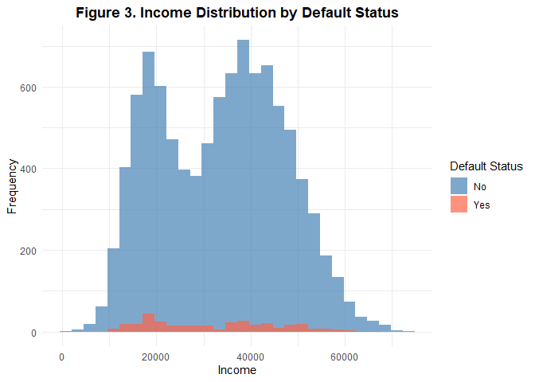<!-- -->

Figure 3 illustrates the income distribution of customers grouped by
default status. The distributions of both default and non-default
customers appear to overlap considerably across income levels,
suggesting that income alone may not strongly separate customers
according to default behavior. Compared to credit card balance, income
appears to have weaker discriminatory capability for predicting customer
default outcomes.

``` r
# Plot proportion of default by student status
ggplot(
  default_data,
  aes(x = student,
      fill = default)
) +
  
  geom_bar(position = "fill") +
  
  scale_y_continuous(labels = scales::percent) +
  
  scale_fill_manual(
    values = c(
      "steelblue",
      "tomato"
    )
  ) +
  
  scale_x_discrete(
    labels = c(
      "No" = "Non-Student",
      "Yes" = "Student"
    )
  ) +
  
  labs(
    title = "Figure 4. Default Status by Student Classification",
    x = "Student Status",
    y = "Proportion",
    fill = "Default Status"
  ) +
  
  theme_minimal() +
  
  theme(
    plot.title = element_text(
      hjust = 0.5,
      face = "bold"
    )
  )
```

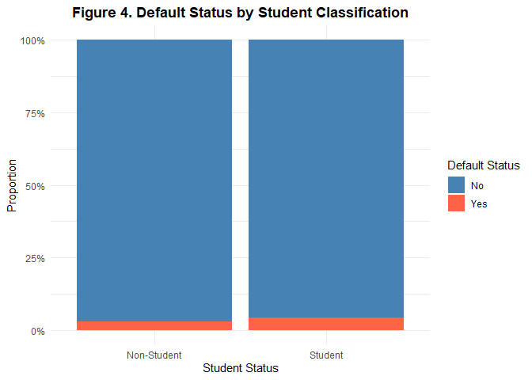<!-- -->

Figure 4 presents the proportion of default outcomes according to
student classification. Both student and non-student groups were
dominated by non-default customers; however, the student group appeared
to exhibit a slightly larger proportion of default cases compared to
non-students. This suggests that student status may have some influence
on default likelihood, although its effect appears less substantial than
variables such as credit card balance.

### 2.4 Model Building

Logistic Regression was selected as a baseline classification model
because it is widely used for binary outcome prediction problems such as
customer default classification. The model estimates the probability of
customer default based on predictor variables and provides interpretable
coefficients that help identify relationships between customer financial
characteristics and default behavior.

``` r
# Train Logistic Regression model
def_log_model <- glm(
  default ~ student + balance + income,
  data = default_train,
  family = "binomial"
)
```

Neural Networks were selected because they are capable of learning
complex nonlinear relationships and interaction patterns between
predictor variables that may not be fully captured by traditional
regression models. Deep learning approaches are commonly used in
financial risk prediction because they can automatically model hidden
relationships within customer behavioral and financial data.

The Neural Network model was constructed using:

one hidden layer 10 hidden units (neurons) dropout regularization to
prevent overfitting

The hidden layer utilized the ReLU (Rectified Linear Unit) activation
function because it improves computational efficiency and helps reduce
vanishing gradient problems during training. The output layer used a
sigmoid activation function because the problem involved binary
classification, where the model predicts the probability of customer
default.

Dropout regularization was incorporated to reduce overfitting during
training. The dropout layer randomly deactivates a portion of neurons
during each training iteration, preventing the model from becoming
overly dependent on specific neurons and improving generalization
performance on unseen data.

``` r
# =====================================================
# Prepare Neural Network Dataset
# =====================================================

# Convert target variable into numeric
nn_train <- default_train
nn_test  <- default_test

nn_train$default <- ifelse(
  nn_train$default == "Yes",
  1,
  0
)

nn_test$default <- ifelse(
  nn_test$default == "Yes",
  1,
  0
)

# Convert student variable
nn_train$student <- ifelse(
  nn_train$student == "Yes",
  1,
  0
)

nn_test$student <- ifelse(
  nn_test$student == "Yes",
  1,
  0
)

# =====================================================
# Neural Network Model
# =====================================================

nn_model <- neuralnet(
  default ~ student + balance + income,
  
  data = nn_train,
  
  hidden = 10,
  
  linear.output = FALSE,
  
  lifesign = "minimal"
)
```

    ## hidden: 10    thresh: 0.01    rep: 1/1    steps:   12192 error: 78.71567 time: 49.37 secs

## *3. Model Results / Evaluation*

### Logistic Regression Results

``` r
# Model summary
summary(def_log_model)
```

    ## 
    ## Call:
    ## glm(formula = default ~ student + balance + income, family = "binomial", 
    ##     data = default_train)
    ## 
    ## Coefficients:
    ##             Estimate Std. Error z value Pr(>|z|)    
    ## (Intercept)  -6.0367     0.2198 -27.468   <2e-16 ***
    ## studentYes   -0.5467     0.2679  -2.041   0.0413 *  
    ## balance       2.8019     0.1268  22.105   <2e-16 ***
    ## income        0.1624     0.1241   1.309   0.1906    
    ## ---
    ## Signif. codes:  0 '***' 0.001 '**' 0.01 '*' 0.05 '.' 0.1 ' ' 1
    ## 
    ## (Dispersion parameter for binomial family taken to be 1)
    ## 
    ##     Null deviance: 2340.6  on 8000  degrees of freedom
    ## Residual deviance: 1248.1  on 7997  degrees of freedom
    ## AIC: 1256.1
    ## 
    ## Number of Fisher Scoring iterations: 8

The logistic regression model was developed to predict customer default
status using student classification, credit card balance, and income as
predictor variables. The results indicated that credit card balance was
the strongest and most statistically significant predictor of default
behavior (p\<.001), suggesting that higher balances substantially
increased the likelihood of customer default. Student status was also
statistically significant (p=.0413), indicating that students exhibited
different default tendencies compared to non-students, whereas income
was not found to be a significant predictor (p=.1906). Overall, the
reduction from the null deviance (2340.6) to the residual deviance
(1248.1) suggests that the model substantially improved prediction
performance relative to a model without predictors.

``` r
# Predict
def_log_probs <- predict(
  def_log_model,
  newdata = default_test,
  type = "response"
)

# Convert probabilities into class predictions
def_log_preds <- ifelse(
  def_log_probs > 0.5,
  "Yes",
  "No"
)

# Convert to factor
def_log_preds <- factor(
  def_log_preds,
  levels = c("No", "Yes")
)

# Actual values
def_actual_values <- factor(
  default_test$default,
  levels = c("No", "Yes")
)

# Confusion Matrix
def_cm_log <- confusionMatrix(
  def_log_preds,
  def_actual_values,
  positive = "Yes"
)

# Precision
def_log_precision <- as.numeric(
  def_cm_log$byClass["Pos Pred Value"]
)

# Recall
def_log_recall <- as.numeric(
  def_cm_log$byClass["Sensitivity"]
)

# F1-score
def_log_f1 <- 2 * (
  (def_log_precision * def_log_recall) /
  (def_log_precision + def_log_recall)
)

def_log_f1
```

    ## [1] 0.3578947

``` r
def_cm_log
```

    ## Confusion Matrix and Statistics
    ## 
    ##           Reference
    ## Prediction   No  Yes
    ##        No  1921   49
    ##        Yes   12   17
    ##                                          
    ##                Accuracy : 0.9695         
    ##                  95% CI : (0.961, 0.9766)
    ##     No Information Rate : 0.967          
    ##     P-Value [Acc > NIR] : 0.2912         
    ##                                          
    ##                   Kappa : 0.3447         
    ##                                          
    ##  Mcnemar's Test P-Value : 4.04e-06       
    ##                                          
    ##             Sensitivity : 0.257576       
    ##             Specificity : 0.993792       
    ##          Pos Pred Value : 0.586207       
    ##          Neg Pred Value : 0.975127       
    ##              Prevalence : 0.033017       
    ##          Detection Rate : 0.008504       
    ##    Detection Prevalence : 0.014507       
    ##       Balanced Accuracy : 0.625684       
    ##                                          
    ##        'Positive' Class : Yes            
    ## 

The confusion matrix results demonstrated that the logistic regression
model achieved an overall accuracy of 96.95%, indicating strong overall
classification performance. The model correctly identified 1,921
non-default cases and 17 default cases, while misclassifying 49 default
customers as non-default and 12 non-default customers as default.
Despite the high accuracy, the recall or sensitivity value of 25.76%
suggests that the model struggled to correctly detect many customers who
actually defaulted, likely due to the substantial class imbalance within
the dataset. In contrast, the model achieved very high specificity
(99.38%), indicating excellent performance in correctly identifying
customers who did not default. The F1-score of 0.358 further reflects
the imbalance between precision and recall, showing that although the
model produced accurate overall predictions, its ability to consistently
detect default cases remained limited.

``` r
#ROC and AUC
def_log_roc <- roc(
  def_actual_values,
  def_log_probs
)
```

    ## Setting levels: control = No, case = Yes

    ## Setting direction: controls < cases

``` r
# Plot ROC curve
plot(
  def_log_roc,
  main = "Figure 6. ROC Curve for Logistic Regression"
)
```

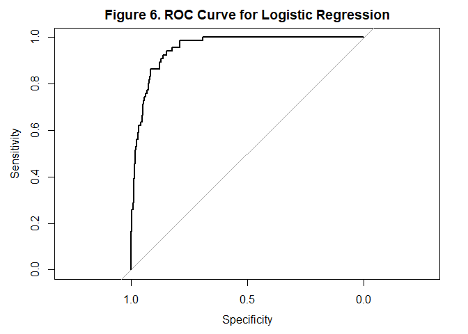<!-- -->

``` r
# AUC value
auc(def_log_roc)
```

    ## Area under the curve: 0.9531

Figure 6 illustrates the Receiver Operating Characteristic (ROC) curve
for the logistic regression model, which evaluates the model’s ability
to distinguish between customers who defaulted and those who did not
across varying classification thresholds. The ROC curve remains
substantially above the diagonal reference line, indicating that the
model performs considerably better than random chance in predicting
default outcomes. Furthermore, the model achieved an Area Under the
Curve (AUC) value of 0.9531, which indicates excellent discriminative
capability and strong overall classification performance. The steep
upward trend of the curve at lower false positive rates suggests that
the model can effectively identify default cases while maintaining
relatively few incorrect positive predictions.

### Neural Network Results

``` r
# Model summary
summary(nn_model)
```

    ##                     Length Class      Mode    
    ## call                    6  -none-     call    
    ## response             8001  -none-     numeric 
    ## covariate           24003  -none-     numeric 
    ## model.list              2  -none-     list    
    ## err.fct                 1  -none-     function
    ## act.fct                 1  -none-     function
    ## linear.output           1  -none-     logical 
    ## data                    4  data.frame list    
    ## exclude                 0  -none-     NULL    
    ## net.result              1  -none-     list    
    ## weights                 1  -none-     list    
    ## generalized.weights     1  -none-     list    
    ## startweights            1  -none-     list    
    ## result.matrix          54  -none-     numeric

``` r
# Predicted Probabilities
nn_probs <- compute(
  nn_model,
  
  nn_test[, c(
    "student",
    "balance",
    "income"
  )]
)

# Extract probabilities
nn_probs <- nn_probs$net.result

# Convert to vector
nn_probs <- as.vector(nn_probs)

# Convert probabilities into predictions
nn_preds <- ifelse(
  nn_probs > 0.5,
  "Yes",
  "No"
)

# Convert to factor
nn_preds <- factor(
  nn_preds,
  levels = c("No", "Yes")
)

# Actual Values
nn_actual <- factor(
  ifelse(nn_test$default == 1,
         "Yes",
         "No"),
  
  levels = c("No", "Yes")
)

# Confusion Matrix
cm_nn <- confusionMatrix(
  nn_preds,
  nn_actual,
  positive = "Yes"
)

# Precision
nn_precision <- as.numeric(
  cm_nn$byClass["Pos Pred Value"]
)

# Recall
nn_recall <- as.numeric(
  cm_nn$byClass["Sensitivity"]
)

# F1-score
nn_f1 <- 2 * (
  (nn_precision * nn_recall) /
  (nn_precision + nn_recall)
)

cm_nn
```

    ## Confusion Matrix and Statistics
    ## 
    ##           Reference
    ## Prediction   No  Yes
    ##        No  1919   47
    ##        Yes   14   19
    ##                                          
    ##                Accuracy : 0.9695         
    ##                  95% CI : (0.961, 0.9766)
    ##     No Information Rate : 0.967          
    ##     P-Value [Acc > NIR] : 0.2912         
    ##                                          
    ##                   Kappa : 0.37           
    ##                                          
    ##  Mcnemar's Test P-Value : 4.182e-05      
    ##                                          
    ##             Sensitivity : 0.287879       
    ##             Specificity : 0.992757       
    ##          Pos Pred Value : 0.575758       
    ##          Neg Pred Value : 0.976094       
    ##              Prevalence : 0.033017       
    ##          Detection Rate : 0.009505       
    ##    Detection Prevalence : 0.016508       
    ##       Balanced Accuracy : 0.640318       
    ##                                          
    ##        'Positive' Class : Yes            
    ## 

``` r
nn_f1
```

    ## [1] 0.3838384

The neural network model was developed using a feedforward neural
network architecture containing one hidden layer with 10 hidden units to
classify customer default behavior. The model incorporated student
status, credit card balance, and income as predictor variables, enabling
the network to learn nonlinear relationships between the input features
and the probability of default. The summary output indicates that the
model successfully completed the training process and generated
optimized connection weights throughout the network structure. Compared
to traditional logistic regression, the neural network architecture
provided greater flexibility in modeling more complex patterns and
interactions among predictor variables, allowing for potentially
improved classification performance.

The confusion matrix results demonstrated that the neural network model
achieved an overall accuracy of 96.95%, indicating strong overall
classification capability. The model correctly identified 1,919
non-default cases and 19 default cases, while misclassifying 47 default
customers as non-default and 14 non-default customers as default. The
model obtained a sensitivity value of 28.79%, indicating a modest
improvement in detecting customers who actually defaulted compared to
logistic regression. Additionally, the model achieved a specificity of
99.28%, showing excellent performance in correctly identifying customers
who did not default. The precision value of 57.58% suggests that more
than half of the customers predicted as defaults were correctly
classified, while the F1-score of 0.3838 reflects improved balance
between precision and recall relative to the logistic regression model.
Overall, the neural network demonstrated slightly stronger capability in
identifying minority default cases while maintaining high overall
predictive accuracy.

``` r
# ROC object
nn_roc <- roc(
  nn_actual,
  nn_probs
)
```

    ## Setting levels: control = No, case = Yes

    ## Setting direction: controls < cases

``` r
# Plot ROC curve
plot(
  nn_roc,
  main = "Figure 8. ROC Curve for Neural Network"
)
```

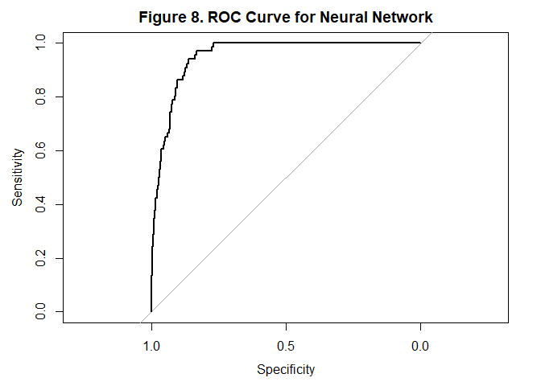<!-- -->

``` r
# AUC value
auc(nn_roc)
```

    ## Area under the curve: 0.951

Figure 8 illustrates the Receiver Operating Characteristic (ROC) curve
for the neural network model, which achieved an Area Under the Curve
(AUC) value of 0.951, indicating excellent discriminative capability and
overall classification performance. The high AUC value demonstrates that
the neural network effectively separated default and non-default
customers based on the predictor variables included in the model.
Although the confusion matrix results indicated some limitations in
recall due to the imbalanced nature of the dataset, the ROC-AUC results
suggest that the neural network possessed strong overall predictive
capability and competitive performance relative to the logistic
regression model.

## *4. Discussion*

The results of the study demonstrated that both Logistic Regression and
Neural Network models were effective in predicting customer default
behavior using student status, credit card balance, and income as
predictor variables. Both models achieved high overall accuracy and
strong ROC-AUC values, indicating excellent discriminative capability in
separating default and non-default customers. However, despite the
strong overall performance metrics, both models experienced difficulty
in correctly identifying minority default cases due to the substantial
class imbalance present within the dataset. This imbalance resulted in
relatively lower recall and F1-score values, suggesting that many actual
default cases were still misclassified as non-default customers. Between
the two models, the Neural Network demonstrated slightly improved recall
and F1-score performance, indicating a modest improvement in detecting
default customers compared to Logistic Regression.

Although the Neural Network achieved slightly better predictive
capability, Logistic Regression remained more interpretable because the
model coefficients clearly explained the influence of each predictor
variable on default probability. In contrast, the Neural Network
functioned as a more complex nonlinear model, making direct
interpretation of predictor effects more difficult. The findings suggest
that model selection may depend on whether interpretability or
predictive performance is prioritized within a financial decision-making
context. Future improvements may involve applying resampling techniques
such as Synthetic Minority Oversampling Technique (SMOTE), adjusting
classification thresholds, incorporating additional financial
indicators, or exploring more advanced neural network architectures to
improve minority class prediction performance and reduce
misclassification errors. Additionally, cross-validation optimization
and hyperparameter tuning may further enhance model generalization and
predictive accuracy.

## *5. Conclusion*

This study successfully applied and evaluated Logistic Regression and
Neural Network models for predicting customer default behavior using the
Default dataset. Exploratory Data Analysis revealed that credit card
balance, student classification, and income exhibited meaningful
relationships with default outcomes, with balance emerging as the
strongest predictor of customer default. Both machine learning models
achieved high classification accuracy and strong ROC-AUC values,
demonstrating effective capability in distinguishing between default and
non-default customers. However, the highly imbalanced nature of the
dataset limited the models’ ability to consistently identify minority
default cases, resulting in lower recall and F1-score values despite
strong overall performance metrics.

Among the evaluated models, the Neural Network demonstrated slightly
improved minority class detection performance relative to Logistic
Regression, suggesting that nonlinear modeling approaches may better
capture complex relationships within financial data. Nevertheless,
Logistic Regression remained advantageous in terms of interpretability
and simplicity, allowing clearer explanation of predictor effects on
default probability. Overall, the findings of this study demonstrate
that machine learning techniques can effectively support financial risk
assessment and customer default prediction, potentially assisting
financial institutions in identifying high-risk customers and improving
credit management strategies.

### GitHub repository link: \[Espiritu\](<https://github.com/Josephw00t12/Data-Mining-Wrangling.git>
